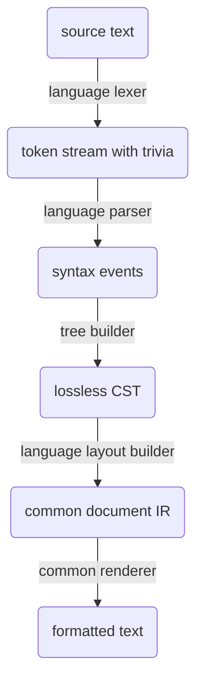

# Jolt Formatter Architecture

## Purpose

The first Jolt product should be a formatter engine for Java and Kotlin source
code.

The formatter is an adoption wedge for Jolt, but it should not be treated as a
throwaway CLI tool. It should be the first durable piece of Jolt's source
tooling substrate: a reusable, wasm-compatible formatting engine with a native
CLI wrapper and a dprint plugin wrapper.

The formatter should be opinionated, deterministic, and small enough to reason
about. It should not chase byte-for-byte compatibility with upstream formatters,
introduce a new formatting style language, or invite users to assemble their own
style from dozens of settings.

## Scope

### In scope

- A reusable formatter engine for Java and Kotlin source text.
- A native CLI wrapper for users who do not use dprint.
- A dprint plugin compiled to `wasm32-unknown-unknown`.
- One Jolt-owned Java formatting policy, informed by established ecosystem
  formatters but not compatible with them by contract.
- One Jolt-owned Kotlin formatting policy, informed by established ecosystem
  formatters but not compatible with them by contract.
- A fixture harness that imports upstream formatter inputs for broad real-world
  coverage.
- A shared document IR and renderer used by both Java and Kotlin layout
  builders.
- Formatter-native syntax infrastructure: lexer, parser, lossless CST, trivia,
  and language-specific CST wrappers.

The Java policy is documented in [`java-format-style.md`](java-format-style.md).
The implementation approach is documented in
[`java-format-implementation-spec.md`](java-format-implementation-spec.md), with
progress and permanent intentional deviations tracked in
[`java-format-implementation-checklist.md`](java-format-implementation-checklist.md).

### Out of scope for the first product

- Gradle integration.
- Maven integration.
- Project model integration.
- Semantic import cleanup.
- Adding missing imports.
- Removing unused imports.
- Linting.
- Autofix beyond formatting.
- Dependency resolution.
- Build execution.
- IDE/LSP integration.
- Arbitrary user-defined formatting configuration.
- Branded formatter suppression comments or compatibility-specific ignore
  spellings.

## Product Shape

The first product is a formatting engine.

```text
formatter engine
  -> native CLI wrapper
  -> dprint wasm plugin
```

The CLI and dprint plugin should be thin shells over the same core engine. The
engine should be pure: given source text, language, and options, it returns
formatted source text plus diagnostics.

```text
source text + language + format options
  -> formatted text + diagnostics
```

The engine should not know about filesystems, directory walking, ignore files,
terminals, process spawning, Gradle, Maven, or editor state.

## Command and Configuration Surface

One formatting invocation may contain both Java and Kotlin files. The public
configuration surface should stay intentionally small.

```bash
jolt fmt
jolt fmt --check

jolt fmt --line-width 80
jolt fmt --indent-width 2
jolt fmt --tabs
```

Tentative defaults:

```text
line-width   = 80
indent-width = 2
tabs         = false
```

The dprint plugin should expose equivalent configuration:

```json
{
  "plugins": ["https://example.invalid/jolt_fmt.wasm"],
  "jolt": { "lineWidth": 80, "indentWidth": 2, "useTabs": false }
}
```

These options are basic rendering constraints, not style presets. Java and
Kotlin share the same public option shape unless a future language-specific
option proves unavoidable.

## File Discovery

File discovery belongs to the native CLI, not the formatter engine.

Default behavior:

```text
default include:
  **/*.{java,kt,kts}

default exclude:
  none

always applied:
  .gitignore
  .ignore
```

User-provided includes replace the default include set.

User-provided excludes stack on top of defaults and ignore-file behavior.

In other words:

```text
final candidate files =
  user_includes.unwrap_or(["**/*.{java,kt,kts}"])
  - user_excludes
  - files ignored by .gitignore or .ignore
```

The wasm engine and dprint plugin should not implement recursive file discovery.

## Architecture Overview

The formatter should own its parser and syntax model.



Language layout builders should consume the lossless CST, usually through
language-specific CST wrappers. These wrappers are ergonomic views over raw
syntax nodes, not a semantic AST and not a replacement for the CST. Layout
builders may still inspect raw tokens, trivia, and syntax elements for comments,
whitespace-sensitive cases, error handling, and formatting edge cases.

For language syntax crates, the intended public API should be the wrapper API
once that layer exists. Raw syntax nodes and syntax kinds remain the lossless
storage and implementation substrate, but formatter, linter, codemod, and other
tooling crates should usually ask wrappers for grammar roles such as names,
conditions, branches, parameters, import paths, and bodies. Building that
wrapper API is a later milestone, not a requirement for the Java parser
milestone.

The architecture should be formatter-native from the beginning. It should not be
built on Tree-sitter, an AST-only parser, or a parser model that loses
whitespace and comments.

The durable architecture is:

```text
Language-specific:
  - lexer
  - parser
  - syntax kinds
  - language-specific CST wrappers
  - CST-to-document layout builder
  - language-specific layout policy

Shared:
  - source text utilities
  - text ranges and line index
  - green/red syntax tree infrastructure
  - trivia representation
  - parser diagnostics
  - document IR
  - renderer
  - engine API
  - wasm-safe option model
```

## Why Not Tree-sitter

Tree-sitter is useful for editor-oriented parsing and error-tolerant syntax
trees, but it is not the right foundation for this formatter.

The formatter needs a lossless source model: tokens, whitespace, comments, byte
ranges, newlines, and trivia attachment. That model is central, not incidental.

The most relevant formatter/toolchain references do not use Tree-sitter as their
source substrate:

- Ruff owns its parser, trivia utilities, Python formatter, and
  language-agnostic formatter IR.
- Biome owns parser infrastructure, a lossless CST with trivia, and formatter
  infrastructure.
- Oxc owns its lexer/parser/AST/trivia/codegen stack.

The lesson is not merely that Tree-sitter is absent. The lesson is that serious
formatter infrastructure tends to own the syntax substrate it depends on.

For Jolt, avoiding Tree-sitter means accepting more initial parser work in
exchange for:

- wasm-first implementation control,
- formatter-native trivia behavior,
- stable syntax APIs for layout builders,
- fewer parser-model impedance mismatches,
- a stronger foundation for later source tools.

## Syntax Model

The formatter should use a lossless concrete syntax tree.

A semantic AST is not sufficient for formatting. Formatting needs source-level
structure, comments, whitespace, and syntactic edge cases. Semantic meaning may
become important for later tools, but pure formatting should remain layout-only.

### Tree model

Use a green/red tree architecture.

Green tree:

- immutable,
- compact,
- parentless,
- stores syntax kind, text length, and children,
- suitable for sharing and future incremental use.

Red tree:

- ergonomic wrapper around green nodes,
- parent-aware,
- computes offsets,
- used for traversal, source-range queries, and language-specific CST access.

The implementation does not need to expose green/red terminology publicly. The
important design point is that storage and ergonomic traversal are separate.

### Elements

The syntax tree should represent:

```text
nodes:
  compilation units / files
  package declarations
  imports
  class declarations
  method declarations
  property declarations
  blocks
  expressions
  annotations
  comments where structurally necessary
  error nodes

tokens:
  identifiers
  keywords
  literals
  operators
  braces
  punctuation
  delimiters

trivia:
  whitespace
  newlines
  line comments
  block comments
  Javadoc
  KDoc
  license headers
  dangling comments
```

### Trivia

Trivia should attach to tokens rather than live only in a side table.

A starting model:

```text
leading trivia:
  whitespace/comments before a token that visually belong to that token

trailing trivia:
  whitespace/comments after a token on the same line that visually belong to the previous token

dangling trivia:
  comments inside otherwise-empty or ambiguous syntax positions
```

The model must handle at least:

- file headers before package declarations,
- Javadoc and KDoc before declarations,
- line comments at the ends of statements,
- comments between modifiers and annotations,
- comments inside empty blocks,
- comments around imports,
- disabled-code comments,
- formatter suppression comments, if added later.

## Parser Architecture

Use hand-written parsers.

For both Java and Kotlin:

```text
lexer:
  source text -> tokens + trivia

parser:
  tokens -> syntax events

tree builder:
  syntax events -> lossless green tree

CST wrapper layer:
  raw syntax nodes -> ergonomic Java/Kotlin CST wrappers
```

The parser should use recursive descent for declarations, statements, types, and
structural syntax. Expressions can use Pratt parsing or precedence climbing.

The parser should support error recovery. A formatter should be able to report
parse errors cleanly and avoid destructive output when source is syntactically
invalid.

Initial formatting should require a fully valid parse. If parsing recovers from
syntax errors, the formatter should refuse to rewrite the file and report the
parse diagnostics instead of trying to format around malformed structure.

That write-safety policy belongs at the public formatter boundary. Below that
boundary, formatter rules should produce the most sensible `Doc` for the CST
shape they are given, without revalidating Java. If a recovered tree contains a
recognizable construct with a missing child, format the construct structurally
and treat the missing child as a hole rather than falling back to raw token
replay.

Partial formatting of recovered trees is a later public capability, not the
first write contract. When added, its policy should decide which recovered
ranges may be rewritten, preserved, or surfaced as diagnostics. Do not add
missing-token nodes, richer skipped-region nodes, or recovery-node APIs until
that partial-formatting policy needs them.

The Java syntax crate's long-term public API should be its wrapper API, not
direct raw CST traversal. The Java parser milestone may expose raw syntax while
wrappers do not exist yet, but formatter code should migrate to wrappers once
that milestone lands.

Language parsers should work with zero configuration. For Java, parse the latest
supported Java grammar by default, but keep recovery lossless and permissive
enough that older source-level conflicts, such as identifiers that later became
keywords or restricted identifiers, still produce a useful tree and diagnostics.
Do not add `--source` or `--release` style parser configuration until formatter
write-safety genuinely requires source-level policy.

### Parser event stream

The parser should not allocate final tree nodes directly. It should emit events
that a tree builder consumes.

Example shape:

```rust
enum Event {
    StartNode(SyntaxKind),
    Token(SyntaxKind),
    FinishNode,
    Error(ParseError),
}
```

This keeps parser control flow separate from syntax tree storage and leaves room
for marker-based parsing patterns where the parser starts a node before it knows
its final kind.

## Formatter IR

The shared formatter middle should be a Wadler/Prettier/Biome-style document
algebra with Ruff/Oxc-style performance discipline.

Language layout builders should not render strings directly. They should convert
the lossless CST into a common document IR. The document IR is a layout program,
not a second token stream with trivia. The renderer then decides where groups
fit, where lines break, and how indentation is applied.

The IR should be close enough to Prettier Java's document model that useful
policy ideas translate naturally: groups, soft lines, hard lines, indentation,
alignment, conditional break content, line suffixes for trailing comments, and
literal text for text blocks. It should not inherit Prettier's willingness to
make arbitrary nested layout choices.

Core IR:

```rust
enum Document {
    Nil,
    Text(String),
    LiteralText(String),
    Line,
    SoftLine,
    HardLine,
    EmptyLine,
    Concat(Vec<Document>),
    Group(Box<Document>),
    ForceGroup(Box<Document>),
    Indent {
        levels: i16,
        contents: Box<Document>,
    },
    Align {
        spaces: i16,
        contents: Box<Document>,
    },
    IfBreak {
        group_id: Option<GroupId>,
        breaks: Box<Document>,
        flat: Box<Document>,
    },
    IndentIfBreak {
        group_id: GroupId,
        contents: Box<Document>,
    },
    LineSuffix(Box<Document>),
    LineSuffixBoundary,
    Fill(Vec<FillEntry>),
    BreakParent,
}
```

`Indent` should be level-based and signed. Public builders should expose
`indent`, `indent_by`, `dedent`, and `dedent_by` so layout code reads by intent
and remains independent of the configured indent width. `Align` is the
fixed-space adjustment primitive for local expression layout, such as ternary
branches that align relative to `?` or `:`.

Do not add a `BestFitting` or conditional-group primitive until a real Java or
Kotlin layout case proves that ordinary groups cannot express the policy. Some
formatters use best-fitting choices for language-specific syntax, such as
optional parentheses in newline-sensitive languages. Java statements are not
newline-sensitive in that way, so the first Jolt formatter should avoid this
surface entirely.

Do not add marker-column fit constraints, group-specific width accounting hooks,
or other compatibility-only fit rules. Selector chains, argument lists,
declaration headers, and comments should be expressed with ordinary groups,
lines, indentation, and line suffixes.

The renderer should be deterministic and linear in the selected document path,
with explicitly bounded fit checks for groups and fill. Adding a primitive
requires documenting its cost model and the Java/Kotlin policy that needs it.

## Formatter Options

Jolt should expose basic rendering constraints, not named compatibility modes.

Initial options:

```rust
pub struct FormatOptions {
    pub line_width: u16,
    pub indent_width: u8,
    pub use_tabs: bool,
}
```

The formatter may gain additional knobs only when they are small, language
agnostic where possible, and needed by real users. Do not add options to emulate
Google Java Format, AOSP, Palantir Java Format, or ktfmt modes.

## Imports Boundary

Import ordering may be formatting.

Import cleanup is not formatting.

`jolt fmt` may:

- sort imports according to Jolt's policy,
- normalize blank lines between import groups according to Jolt's policy.

`jolt fmt` must not:

- remove unused imports,
- add missing imports,
- rename symbols,
- perform semantic refactors,
- expand or collapse wildcard imports unless that behavior is part of Jolt's
  documented formatting policy and can be reproduced safely without project
  resolution.

A future `jolt imports` command can perform semantic or project-aware import
cleanup.

## Engine API

The formatter core should expose a small, wasm-safe API.

Conceptual shape:

```rust
pub fn format_source(source: &str, language: Language, options: FormatOptions) -> FormatResult;

pub enum Language {
    Java,
    Kotlin,
}

pub struct FormatResult {
    pub text: String,
    pub diagnostics: Vec<Diagnostic>,
}
```

The real API may need allocation-aware or FFI-friendly variants for dprint, but
the conceptual contract should remain pure.

## Crate Layout

Tentative crate layout:

```text
crates/
  jolt_text/
    SourceText
    TextSize
    TextRange
    LineIndex
    UTF-8 byte/char utilities

  jolt_syntax/
    GreenNode
    GreenToken
    SyntaxNode
    SyntaxToken
    SyntaxElement
    Trivia
    syntax tree traversal
    error nodes

  jolt_java_syntax/
    JavaSyntaxKind
    Java lexer
    Java parser
    Java CST wrappers

  jolt_kotlin_syntax/
    KotlinSyntaxKind
    Kotlin lexer
    Kotlin parser
    Kotlin CST wrappers

  jolt_fmt_ir/
    document IR
    groups
    indentation
    line breaking
    renderer

  jolt_java_fmt/
    Java CST -> document layout builder
    Jolt Java layout policy

  jolt_kotlin_fmt/
    Kotlin CST -> document layout builder
    Jolt Kotlin layout policy

  jolt_fmt_core/
    public format API
    language dispatch
    option normalization
    diagnostics

  jolt_fmt_cli/
    native CLI wrapper

  jolt_fmt_dprint/
    wasm dprint plugin

tools/
  fixtures/
    native-only fixture import/update helpers invoked by mise
```

The exact crate boundaries can change, but the concern boundaries should remain
stable.

## Native CLI Wrapper

The CLI owns user-facing command behavior:

- file discovery,
- `.gitignore` and `.ignore` handling,
- include/exclude options,
- check mode,
- write mode,
- stdin/stdout,
- terminal diagnostics,
- optional diff output,
- parallel formatting,
- config file loading, if added.

The CLI should call the same formatter engine used by the dprint plugin.

## dprint Plugin

The dprint plugin should compile to `wasm32-unknown-unknown`.

The plugin owns only dprint integration:

- file extension registration,
- dprint config parsing,
- mapping dprint config to Jolt format options,
- calling the core formatter engine.

The plugin should not contain separate formatting behavior.

The dprint plugin is the reason wasm compatibility must be a hard local build
target from the beginning.

## Fixture Import

Fixture import tooling is native-only. It can spawn JVM tools, clone upstream
repositories, and perform filesystem-heavy fixture import work.

The engine and dprint plugin must not depend on fixture import machinery.

### Fixture suites

Initial imported fixture suites:

```text
google-java-format:
  upstream fixtures: google-java-format fixtures

palantir-java-format:
  upstream fixtures: palantir-java-format fixtures

prettier-java:
  upstream fixtures: prettier-java unit-test fixtures
  notes: mixed full-file and snippet/edge-case formatter inputs

ktfmt:
  upstream fixtures: ktfmt fixtures
```

### Fixture import

Fixture input import should happen during an explicit import/update step.
Materialized upstream outputs may be kept as reference artifacts, but they are
not pass/fail expectations for Jolt.

```text
mise run import-fixtures
  -> checkout pinned upstream formatter repos
  -> collect fixture inputs
  -> write inputs into Jolt's fixture directory
  -> optionally materialize upstream outputs for advisory reports
```

Ordinary test runs should not spawn upstream formatters.

```text
cargo test -p jolt_java_fmt
  -> read materialized Java fixture inputs
  -> run Jolt formatter in-process
  -> assert deterministic output and idempotence
  -> optionally report advisory diffs against upstream reference outputs
```

No hash cache is necessary for the initial design. Fixture import is a
deliberate update operation, and normal tests are pure and fast.

Not every imported fixture suite has the same validity contract. The Google Java
Format and Palantir Java Format inputs are parser-clean Java source corpora
except for explicitly listed invalid upstream cases. Prettier Java unit fixtures
are broader formatter examples and may include snippets or intentionally invalid
edge cases; use them for formatter/reference coverage, not strict
compilation-unit parser gates.

### Owned tests

Jolt should use imported upstream fixture inputs for broad coverage.

Owned tests should focus on Jolt-owned behavior:

- CLI check/write/stdin/stdout behavior,
- include/exclude/ignore behavior,
- dprint plugin loading and config mapping,
- engine API behavior,
- wasm build viability,
- invalid syntax diagnostics,
- narrow regression cases not covered by imported fixture inputs.

## Formatter Implementation Plan

The formatter is Jolt's first product. The implementation should start from real
Java fixture inputs, then build complete Java layers in order. It should not
start with an abstract formatter substrate detached from real source files, and
it should not build a narrow vertical path that only handles convenient Java
files.

The first end-to-end product target is Java. The architecture should preserve
the planned multi-language shape, but Java should be implemented through the
engine, native CLI, dprint wrapper, and Jolt Java layout policy before Kotlin
implementation work begins.

Tests should live with the implementation they exercise:

- Java formatter fixture coverage and idempotence tests live in `jolt_java_fmt`.
- Core API behavior lives in `jolt_fmt_core`.
- CLI behavior lives in `jolt_fmt_cli`.
- dprint behavior lives in `jolt_fmt_dprint`.
- Fixture import/update tooling is invoked through mise and is not a formatter
  test crate.

### Milestone 1: workspace, mise tasks, and Java fixture import

Status: complete.

Create the minimum repository structure needed to import real Java formatter
fixtures.

Add:

- Rust workspace skeleton,
- mise tasks for fixture import/update,
- native-only fixture import helpers under `tools/fixtures`,
- Java fixture directory layout,
- fixture metadata format,
- pinned upstream source metadata for Google Java Format,
- pinned upstream source metadata for Palantir Java Format,
- pinned upstream source metadata for Prettier Java,
- materialized Java input fixtures,
- optional upstream formatter outputs for advisory reports.

The import operation is explicit:

```bash
mise run import-fixtures
```

This milestone answers the first implementation question: which Java files must
Jolt parse, preserve, and format deterministically?

### Milestone 2: core formatter contract

Status: complete.

Define the API all wrappers and tests will call before implementing Java
formatting behavior.

Add crates and types for:

- `jolt_text`,
- `jolt_fmt_core`,
- `Language`,
- `FormatOptions`,
- `FormatResult`,
- `Diagnostic`,
- `format_source`.

The API should be filesystem-free and wasm-safe from the beginning. Local checks
should include native builds and wasm builds for crates that are expected to
compile to `wasm32-unknown-unknown`.

### Milestone 3: shared diagnostics and syntax outcome policy

Status: complete.

Replace the temporary string-only diagnostic shape with the shared diagnostic
model before more lexer/parser/formatter layers depend on diagnostic policy.
Keep diagnostics as facts about source/tooling issues, and keep formatter
write-safety decisions in formatter policy derived from lexer/parser outcomes.

Add:

- one shared diagnostic data shape,
- stable diagnostic codes,
- severity,
- human message,
- text range,
- source stage, such as lexer, parser, or formatter,
- lexer/parser outcome state, such as clean, recovered, or aborted,
- Java lexer/parser diagnostics authored in the shared shape,
- core tests for formatter no-write decisions based on syntax outcomes.

Language-specific diagnostic codes are acceptable inside the shared shape. For
example, a Java parser diagnostic may have a Java-specific code, but CLI,
dprint, and formatter failure policy should consume the same diagnostic model
used by every language.

The first write-safety policy can remain conservative:

```text
If lexing/parsing recovers from errors or aborts, do not write formatted output
by default.
```

Formatting with recovered syntax outcomes can be designed later behind an
explicit policy once Jolt can prove the output is non-destructive. Formatter
rules should still be total over the CST nodes they accept so this future policy
can reuse the normal layout rules instead of depending on raw-token recovery
branches.

### Milestone 4: Java lexer over the full Java corpus

Status: complete.

Build the Java lexer against every valid Java source file in the imported Java
fixture corpus.

Add:

- `jolt_java_syntax`,
- Java token kinds,
- keyword recognition,
- literals,
- operators and punctuation,
- leading and trailing trivia,
- token text ranges,
- lexer diagnostics,
- token stream round-trip tests over all imported Java fixture inputs.

This layer should operate correctly on the full imported Java corpus before
parser work depends on it. The goal is not formatting yet. The goal is that Jolt
can represent every byte, newline, token, and comment in the Java inputs without
loss.

### Milestone 5: Java lossless syntax tree over the full Java corpus

Status: complete.

Build the Java parser and syntax tree after the lexer has proven it can cover
the corpus.

Add:

- `jolt_syntax`,
- green tree storage,
- red tree traversal wrappers,
- Java parser event stream,
- Java grammar coverage for valid source in the imported fixture corpus,
- error nodes and parser diagnostics,
- parse tests over all imported Java fixture inputs.

This milestone should not be a minimal parser for a formatter demo. The parser
layer should handle the valid Java source Jolt has imported before the Java
layout builder is built on top of it.

### Milestone 6: Java CST wrappers

Status: complete.

Add typed Java CST wrappers after the raw Java CST shape is stable enough to
wrap without churn.

Wrappers are typed views over raw syntax nodes, not a semantic AST. They should
be the public Java syntax API, with raw red-tree traversal kept internal to
`jolt_java_syntax`.

Add a complete macro-declared wrapper layer for Java CST node kinds and
grammar-family enums. The schema should be handwritten, but repetitive wrapper
plumbing should be generated by Rust macros rather than external source-level
code generation.

Complete this syntax access layer to production quality before building the Java
layout builder on top of it.

### Milestone 7: shared document IR and renderer

Status: complete.

Build the shared document IR and renderer as a complete formatting substrate
before language layout builders depend on it.

Add:

- `jolt_fmt_ir`,
- `Text`,
- `Line`,
- `SoftLine`,
- `HardLine`,
- `Concat`,
- `Group`,
- `Indent`,
- `IfBreak`,
- width-aware rendering,
- indentation handling,
- local renderer tests for the supported document algebra.

The IR should stay small, but it should be designed and tested as a shared layer
for Java and Kotlin formatting. Add new IR features only when the existing
algebra cannot express required formatter layouts.

### Milestone 8: Jolt Java layout builder

Status: complete.

Implement Jolt's Java formatter on top of the completed lexer, parser, CST,
document IR, and renderer.

The implementation target is the Jolt style guide in
[`java-format-style.md`](java-format-style.md). Build it according to
[`java-format-implementation-spec.md`](java-format-implementation-spec.md) and
keep
[`java-format-implementation-checklist.md`](java-format-implementation-checklist.md)
up to date as implementation lands.

Add:

- `jolt_java_fmt`,
- Java CST-to-document layout builder,
- Java wiring in `format_source`,
- fixture-input coverage in `jolt_java_fmt`,
- idempotence checks for all successfully formatted fixture inputs,
- deterministic-output checks for repeated formatting runs.

The coverage target is the full imported Java input corpus. Advisory reports may
compare Jolt output against upstream formatter outputs, but those diffs are not
pass/fail compatibility gates.

### Milestone 9: Java comments and trivia hardening

Status: pending.

Tighten the parts most likely to cause destructive output after the main layout
builder exists.

Add:

- license headers,
- comments around imports,
- trailing line comments,
- dangling comments in empty blocks and argument lists,
- disabled-code comments,
- blank-line normalization,
- narrowed regression fixtures for cases not present upstream.

Owned regression fixtures are appropriate here because they cover Jolt-owned
safety behavior or gaps in imported fixture inputs.

Parse-error no-write behavior belongs to the shared diagnostics/failure-policy
milestone. This milestone may add Java-specific regression cases that exercise
that policy with comments and tricky trivia, but it should not define the core
diagnostic model.

### Milestone 10: native CLI wrapper

Status: pending.

Add the CLI after the Java engine can format real fixture inputs through
`format_source`. The detailed CLI/config behavior is specified in
[`formatter-milestone-10-cli-spec.md`](formatter-milestone-10-cli-spec.md).

Add:

- `jolt_fmt_cli`,
- `jolt fmt`,
- stdin/stdout,
- default write mode for filesystem inputs,
- `--check`,
- `--line-width`,
- `--indent-width`,
- `--tabs`,
- `--spaces`,
- `--config`,
- `--no-config`,
- config loading with Figment,
- include/exclude handling,
- default `**/*.java` discovery for the Java phase,
- `jolt.toml` and `.config/jolt.toml` discovery,
- `.gitignore` and `.ignore` handling through the `ignore` crate,
- owned CLI tests.

The CLI should only call `jolt_fmt_core`. It should not implement formatting
behavior.

### Milestone 11: dprint wrapper

Status: pending.

Add dprint integration after the core API has survived real Java formatting work
and the core crates already have local wasm build checks.

Add:

- `jolt_fmt_dprint`,
- wasm plugin build through the local check path,
- dprint plugin config mapping,
- Java extension registration,
- dprint invocation tests over Java files from the committed fixture corpus.

This milestone proves the dprint wrapper is thin. The plugin should not get a
separate layout builder or option model.

### Milestone 12: Java formatter hardening

Status: pending.

Cut across the Java product surface after the Java formatter has meaningful
fixture coverage.

Add:

- stable diagnostics wording,
- check/write exit code guarantees,
- documented parse-error and no-write behavior,
- performance baselines on the committed fixture corpus,
- final dprint plugin smoke tests,
- formatter README or user docs.

This milestone turns the accumulated work into the first coherent Java formatter
product.

### Milestone 13: Kotlin formatter

Status: pending.

Start Kotlin after the Java formatter, shared renderer, CLI, and dprint wrapper
have proven the Jolt-owned formatter contract.

Add:

- Kotlin fixture input import,
- Kotlin lexer and parser coverage over imported inputs,
- `jolt_kotlin_fmt`,
- Kotlin CST-to-document layout builder,
- Kotlin wiring in `format_source`,
- CLI and dprint extension coverage for `.kt` and `.kts`.

Kotlin should repeat the same fixture-first, layer-complete process with ktfmt
inputs without treating ktfmt outputs as pass/fail expectations.

## Formatting Goals

The formatter should be judged by Jolt's own contract, not byte-for-byte
compatibility with upstream formatter outputs.

Required for parser-clean Java inputs:

```text
deterministic output across repeated runs
idempotence after one formatting pass
stable, documented layout policy
bounded, predictable rendering behavior
no parse failures on valid fixture inputs
```

Required for the shared renderer:

```text
small document algebra
linear or otherwise explicitly bounded rendering passes
no best-fitting or conditional-group primitive without a proven Java/Kotlin need
no compatibility-only primitives unless Jolt's own layout policy needs them
```

Advisory reports may summarize diffs against Google Java Format, Palantir Java
Format, Prettier Java, or ktfmt outputs to help humans evaluate Jolt's style.
Those reports are not release gates.

## Failure Behavior

The formatter should avoid destructive output.

If lexing or parsing fails severely, the formatter should return diagnostics and
avoid rewriting the file unless a safe partial-formatting strategy is explicitly
designed.

The first implementation can choose a conservative rule:

```text
If lexing/parsing recovers from errors or aborts, do not write formatted output
by default.
```

Later, Jolt can choose to format through recovered lexer/parser outcomes behind
an explicit policy.

Formatting with recovered syntax is in scope as a later capability, but not as
the default write behavior. The rule layer should nevertheless format recovered
CST shapes structurally when the construct is recognizable; the public policy
decides whether that output is written. Biome exposes this as an explicit
`formatWithErrors` option, and Oxc's parser architecture treats recovery as
important for formatters and linters. Jolt should first build lexer/parser
recovery for diagnostics and tree construction, model recovered versus aborted
syntax outcomes, then only allow formatting through recovered outcomes behind an
explicit policy once it can prove the output is non-destructive.

The shared diagnostic model needed for this policy is defined early in
milestone 3.

## Formatter Suppression Comments

Do not add formatter suppression comments to the initial Java formatter.

Modern formatter ecosystems do have precedent for this feature: Ruff supports
formatter pragmas, Biome supports formatter ignore comments, and Oxfmt supports
inline formatter ignore comments. That makes suppression comments a legitimate
future escape hatch, but not something Jolt should invent before the Java
formatter contract is stable.

Suppression comments should only be added later as explicit Jolt behavior.

## Shared Syntax Boundary

Share syntax infrastructure where it is storage-shaped, not grammar-shaped.

Shared:

- source text, text ranges, text sizes, and line indexes,
- green node/token storage,
- red node/token traversal,
- syntax elements and tree walking,
- trivia storage primitives,
- parser event stream and tree builder,
- diagnostics data structures,
- test helpers for lossless round-tripping.

Language-specific:

- syntax kind enums,
- lexer rules,
- grammar and parser recovery rules,
- language-specific CST wrappers,
- comment attachment policy where language syntax requires it,
- formatter layout builders.

The rule is: Java should prove the generic storage APIs, but Kotlin should not
inherit Java's grammar model. When Kotlin needs a different shape, keep that
difference language-owned unless both languages genuinely need the same
abstraction.

## Design Principles

### Own the substrate

Formatting depends on syntax shape, token ranges, and trivia. Jolt should own
those layers.

### Keep the core pure

The core formatter should be deterministic, wasm-compatible, and
filesystem-free.

### Reuse the middle

Java and Kotlin need separate syntax frontends and layout builders, but they
should share the document IR and renderer.

### Let fixtures guide coverage

Imported upstream fixture inputs are broad coverage. Materialized upstream
outputs are advisory references, not Jolt's formatting contract.

### Avoid style configuration sprawl

Expose a few basic rendering options, not named compatibility modes or a style
language.

### Keep formatting layout-only

Formatting should not perform semantic source actions.

## References

Architecture and formatter references:

- Philip Wadler, "A prettier printer":
  https://homepages.inf.ed.ac.uk/wadler/papers/prettier/prettier.pdf
- Biome architecture: https://biomejs.dev/internals/architecture/
- Biome formatter documentation: https://biomejs.dev/formatter/
- Biome configuration reference: https://biomejs.dev/reference/configuration/
- Biome formatter crate: https://docs.rs/biome_formatter
- Ruff formatter documentation: https://docs.astral.sh/ruff/formatter/
- Ruff contributing architecture notes:
  https://docs.astral.sh/ruff/contributing/
- Oxc parser documentation: https://oxc.rs/docs/contribute/parser.html
- Oxc parser error recovery notes:
  https://oxc.rs/docs/learn/parser_in_rust/errors
- Oxfmt ignore comments:
  https://oxc.rs/docs/guide/usage/formatter/ignore-comments.html
- Oxc architecture: https://github.com/oxc-project/oxc/blob/main/ARCHITECTURE.md
- dprint Wasm plugin development:
  https://github.com/dprint/dprint/blob/main/docs/wasm-plugin-development.md

Formatter references:

- Google Java Format: https://github.com/google/google-java-format
- Palantir Java Format: https://github.com/palantir/palantir-java-format
- Prettier Java: https://github.com/jhipster/prettier-java
- ktfmt: https://github.com/facebook/ktfmt

## Resolved Decisions

- Initial Java formatter: no formatter suppression comments.
- Parse errors: no writes by default; recoverable-error formatting can be added
  later behind an explicit policy.
- Formatter configuration: expose basic rendering options, not named
  compatibility modes.
- Syntax sharing: share storage, traversal, events, diagnostics, and text
  utilities; keep grammar, CST wrappers, and layout builders language-specific.
