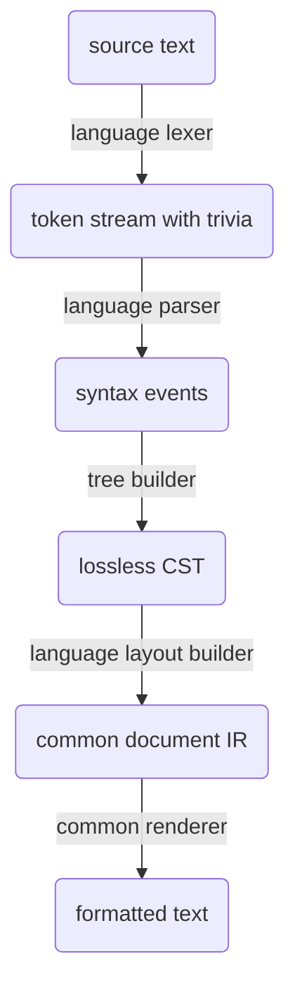

# Jolt Formatter Architecture

## Purpose

The first Jolt product should be a formatter engine for Java and Kotlin source
code.

The formatter is an adoption wedge for Jolt, but it should not be treated as a
throwaway CLI tool. It should be the first durable piece of Jolt's source
tooling substrate: a reusable, wasm-compatible formatting engine with a native
CLI wrapper and a dprint plugin wrapper.

The formatter should be opinionated, profile-driven, and compatibility-oriented.
It should not introduce a new formatting style language, expose arbitrary
formatting knobs, or invite users to assemble their own style from dozens of
settings.

## Scope

### In scope

- A reusable formatter engine for Java and Kotlin source text.
- A native CLI wrapper for users who do not use dprint.
- A dprint plugin compiled to `wasm32-unknown-unknown`.
- Java formatting profiles compatible with:
  - Google Java Format.
  - Google Java Format AOSP mode.
  - Palantir Java Format.
- Kotlin formatting profiles compatible with:
  - ktfmt's default/Meta style.
  - ktfmt's Google style.
  - ktfmt's Kotlin language style.
- An oracle test harness that imports upstream formatter fixtures and
  materializes expected outputs.
- A shared document IR and renderer used by both Java and Kotlin layout
  builders.
- Formatter-native syntax infrastructure: lexer, parser, lossless CST, trivia,
  and language-specific CST wrappers.

### Out of scope for the first product

- Gradle integration.
- Maven integration.
- Project model integration.
- Semantic import cleanup.
- Adding missing imports.
- Removing unused imports.
- Linting.
- Autofix beyond formatting.
- Dependency resolution.
- Build execution.
- IDE/LSP integration.
- Arbitrary user-defined formatting configuration.
- Formatter suppression comments for the initial Java formatter.

## Product Shape

The first product is a formatting engine.

```text
formatter engine
  -> native CLI wrapper
  -> dprint wasm plugin
```

The CLI and dprint plugin should be thin shells over the same core engine. The
engine should be pure: given source text, language, and options, it returns
formatted source text plus diagnostics.

```text
source text + language + format options
  -> formatted text + diagnostics
```

The engine should not know about filesystems, directory walking, ignore files,
terminals, process spawning, Gradle, Maven, or editor state.

## Command and Configuration Surface

One formatting invocation may contain both Java and Kotlin files, so profile
options must be language-scoped.

```bash
jolt fmt
jolt fmt --check

jolt fmt --java-profile google
jolt fmt --java-profile aosp
jolt fmt --java-profile palantir

jolt fmt --kotlin-profile meta
jolt fmt --kotlin-profile google
jolt fmt --kotlin-profile kotlinlang
```

Tentative defaults:

```text
java-profile   = google
kotlin-profile = meta
```

The dprint plugin should expose equivalent configuration:

```json
{
  "plugins": ["https://example.invalid/jolt_fmt.wasm"],
  "jolt": { "javaProfile": "google", "kotlinProfile": "meta" }
}
```

Profiles configure Jolt's internal formatter behavior. They are not oracle
definitions. Oracle suites are test harness concepts that compare one Jolt
profile configuration against one upstream formatter's output.

## File Discovery

File discovery belongs to the native CLI, not the formatter engine.

Default behavior:

```text
default include:
  **/*.{java,kt,kts}

default exclude:
  none

always applied:
  .gitignore
  .ignore
```

User-provided includes replace the default include set.

User-provided excludes stack on top of defaults and ignore-file behavior.

In other words:

```text
final candidate files =
  user_includes.unwrap_or(["**/*.{java,kt,kts}"])
  - user_excludes
  - files ignored by .gitignore or .ignore
```

The wasm engine and dprint plugin should not implement recursive file discovery.

## Architecture Overview

The formatter should own its parser and syntax model.



Language layout builders should consume the lossless CST, usually through
language-specific CST wrappers. These wrappers are ergonomic views over raw
syntax nodes, not a semantic AST and not a replacement for the CST. Layout
builders may still inspect raw tokens, trivia, and syntax elements for comments,
whitespace-sensitive cases, error handling, and formatting edge cases.

The architecture should be formatter-native from the beginning. It should not be
built on Tree-sitter, an AST-only parser, or a parser model that loses
whitespace and comments.

The durable architecture is:

```text
Language-specific:
  - lexer
  - parser
  - syntax kinds
  - language-specific CST wrappers
  - CST-to-document layout builder
  - profile behavior

Shared:
  - source text utilities
  - text ranges and line index
  - green/red syntax tree infrastructure
  - trivia representation
  - parser diagnostics
  - document IR
  - renderer
  - engine API
  - wasm-safe option model
```

## Why Not Tree-sitter

Tree-sitter is useful for editor-oriented parsing and error-tolerant syntax
trees, but it is not the right foundation for this formatter.

The formatter needs a lossless source model: tokens, whitespace, comments, byte
ranges, newlines, and trivia attachment. That model is central, not incidental.

The most relevant formatter/toolchain references do not use Tree-sitter as their
source substrate:

- Ruff owns its parser, trivia utilities, Python formatter, and
  language-agnostic formatter IR.
- Biome owns parser infrastructure, a lossless CST with trivia, and formatter
  infrastructure.
- Oxc owns its lexer/parser/AST/trivia/codegen stack.

The lesson is not merely that Tree-sitter is absent. The lesson is that serious
formatter infrastructure tends to own the syntax substrate it depends on.

For Jolt, avoiding Tree-sitter means accepting more initial parser work in
exchange for:

- wasm-first implementation control,
- formatter-native trivia behavior,
- stable syntax APIs for layout builders,
- fewer parser-model impedance mismatches,
- a stronger foundation for later source tools.

## Syntax Model

The formatter should use a lossless concrete syntax tree.

A semantic AST is not sufficient for formatting. Formatting needs source-level
structure, comments, whitespace, and syntactic edge cases. Semantic meaning may
become important for later tools, but pure formatting should remain layout-only.

### Tree model

Use a green/red tree architecture.

Green tree:

- immutable,
- compact,
- parentless,
- stores syntax kind, text length, and children,
- suitable for sharing and future incremental use.

Red tree:

- ergonomic wrapper around green nodes,
- parent-aware,
- computes offsets,
- used for traversal, source-range queries, and language-specific CST access.

The implementation does not need to expose green/red terminology publicly. The
important design point is that storage and ergonomic traversal are separate.

### Elements

The syntax tree should represent:

```text
nodes:
  compilation units / files
  package declarations
  imports
  class declarations
  method declarations
  property declarations
  blocks
  expressions
  annotations
  comments where structurally necessary
  error nodes

tokens:
  identifiers
  keywords
  literals
  operators
  braces
  punctuation
  delimiters

trivia:
  whitespace
  newlines
  line comments
  block comments
  Javadoc
  KDoc
  license headers
  dangling comments
```

### Trivia

Trivia should attach to tokens rather than live only in a side table.

A starting model:

```text
leading trivia:
  whitespace/comments before a token that visually belong to that token

trailing trivia:
  whitespace/comments after a token on the same line that visually belong to the previous token

dangling trivia:
  comments inside otherwise-empty or ambiguous syntax positions
```

The model must handle at least:

- file headers before package declarations,
- Javadoc and KDoc before declarations,
- line comments at the ends of statements,
- comments between modifiers and annotations,
- comments inside empty blocks,
- comments around imports,
- disabled-code comments,
- formatter suppression comments, if added later.

## Parser Architecture

Use hand-written parsers.

For both Java and Kotlin:

```text
lexer:
  source text -> tokens + trivia

parser:
  tokens -> syntax events

tree builder:
  syntax events -> lossless green tree

CST wrapper layer:
  raw syntax nodes -> ergonomic Java/Kotlin CST wrappers
```

The parser should use recursive descent for declarations, statements, types, and
structural syntax. Expressions can use Pratt parsing or precedence climbing.

The parser should support error recovery. A formatter should be able to report
parse errors cleanly and avoid destructive output when source is syntactically
invalid.

### Parser event stream

The parser should not allocate final tree nodes directly. It should emit events
that a tree builder consumes.

Example shape:

```rust
enum Event {
    StartNode(SyntaxKind),
    Token(SyntaxKind),
    FinishNode,
    Error(ParseError),
}
```

This keeps parser control flow separate from syntax tree storage and leaves room
for marker-based parsing patterns where the parser starts a node before it knows
its final kind.

## Formatter IR

The shared formatter middle should be a Wadler/Prettier/Biome-style document
algebra.

Language layout builders should not render strings directly. They should convert
the lossless CST into a common document IR. The document IR is a layout program,
not a second token stream with trivia. The renderer then decides where groups
fit, where lines break, and how indentation is applied.

Minimum IR:

```rust
enum Document {
    Nil,
    Text(String),
    Line,
    SoftLine,
    HardLine,
    Concat(Vec<Document>),
    Group(Box<Document>),
    Indent(Box<Document>),
    IfBreak {
        breaks: Box<Document>,
        flat: Box<Document>,
    },
}
```

Likely later additions:

```text
LineSuffix
LineSuffixBoundary
Fill
BestFitting
Labelled groups
Profile-sensitive conditional groups
```

The first implementation should stay small. Add IR features only when real
Java/Kotlin formatting cases require them.

## Formatting Profiles

Profiles should be small product-level choices.

They should configure internal whitespace and line-breaking behavior, but should
not expose arbitrary style options.

Tentative profile enums:

```rust
pub enum JavaProfile {
    Google,
    Aosp,
    Palantir,
}

pub enum KotlinProfile {
    Meta,
    Google,
    Kotlinlang,
}
```

A single formatter invocation may use both a Java profile and a Kotlin profile.

```rust
pub struct FormatOptions {
    pub java_profile: JavaProfile,
    pub kotlin_profile: KotlinProfile,
}
```

The formatter should not treat profiles as external executable choices. External
executables are only used by the oracle harness.

## Imports Boundary

Import ordering may be formatting.

Import cleanup is not formatting.

`jolt fmt` may:

- sort imports according to the active profile,
- normalize blank lines between import groups according to the active profile.

`jolt fmt` must not:

- remove unused imports,
- add missing imports,
- rename symbols,
- perform semantic refactors,
- expand or collapse wildcard imports unless that behavior is strictly part of
  the selected profile's formatting behavior and can be reproduced safely
  without project resolution.

A future `jolt imports` command can perform semantic or project-aware import
cleanup.

## Engine API

The formatter core should expose a small, wasm-safe API.

Conceptual shape:

```rust
pub fn format_source(source: &str, language: Language, options: FormatOptions) -> FormatResult;

pub enum Language {
    Java,
    Kotlin,
}

pub struct FormatResult {
    pub text: String,
    pub diagnostics: Vec<Diagnostic>,
}
```

The real API may need allocation-aware or FFI-friendly variants for dprint, but
the conceptual contract should remain pure.

## Crate Layout

Tentative crate layout:

```text
crates/
  jolt_text/
    SourceText
    TextSize
    TextRange
    LineIndex
    UTF-8 byte/char utilities

  jolt_syntax/
    GreenNode
    GreenToken
    SyntaxNode
    SyntaxToken
    SyntaxElement
    Trivia
    syntax tree traversal
    error nodes

  jolt_java_syntax/
    JavaSyntaxKind
    Java lexer
    Java parser
    Java CST wrappers

  jolt_kotlin_syntax/
    KotlinSyntaxKind
    Kotlin lexer
    Kotlin parser
    Kotlin CST wrappers

  jolt_fmt_ir/
    document IR
    groups
    indentation
    line breaking
    renderer

  jolt_java_fmt/
    Java CST -> document layout builder
    Google/AOSP/Palantir profile behavior

  jolt_kotlin_fmt/
    Kotlin CST -> document layout builder
    ktfmt meta, google, and kotlinlang profile behavior

  jolt_fmt_core/
    public format API
    language dispatch
    option normalization
    diagnostics

  jolt_fmt_cli/
    native CLI wrapper

  jolt_fmt_dprint/
    wasm dprint plugin

tools/
  oracles/
    native-only oracle fixture import/update helpers invoked by mise
```

The exact crate boundaries can change, but the concern boundaries should remain
stable.

## Native CLI Wrapper

The CLI owns user-facing command behavior:

- file discovery,
- `.gitignore` and `.ignore` handling,
- include/exclude options,
- check mode,
- write mode,
- stdin/stdout,
- terminal diagnostics,
- optional diff output,
- parallel formatting,
- config file loading, if added.

The CLI should call the same formatter engine used by the dprint plugin.

## dprint Plugin

The dprint plugin should compile to `wasm32-unknown-unknown`.

The plugin owns only dprint integration:

- file extension registration,
- dprint config parsing,
- mapping dprint config to Jolt format options,
- calling the core formatter engine.

The plugin should not contain separate formatting behavior.

The dprint plugin is the reason wasm compatibility must be a hard local build
target from the beginning.

## Oracle Fixtures and Import

Oracle import tooling is native-only. It can spawn JVM tools, clone upstream
repositories, and perform filesystem-heavy fixture import work.

The engine and dprint plugin must not depend on oracle machinery.

### Oracle suites

Initial oracle suites:

```text
google-java-format:
  upstream fixtures: google-java-format fixtures
  profiles:
    google:
      upstream executable: google-java-format --skip-removing-unused-imports
      Jolt config: java-profile = google
    aosp:
      upstream executable: google-java-format --aosp --skip-removing-unused-imports
      Jolt config: java-profile = aosp

palantir-java-format:
  upstream fixtures: palantir-java-format fixtures
  profiles:
    palantir:
      upstream executable: palantir-java-format --palantir --skip-removing-unused-imports
      Jolt config: java-profile = palantir

ktfmt:
  upstream fixtures: ktfmt fixtures
  profiles:
    meta:
      upstream executable: ktfmt
      Jolt config: kotlin-profile = meta
    google:
      upstream executable: ktfmt --google-style
      Jolt config: kotlin-profile = google
    kotlinlang:
      upstream executable: ktfmt --kotlinlang-style
      Jolt config: kotlin-profile = kotlinlang
```

### Fixture import

Oracle output should be materialized during an explicit import/update step.

```text
mise run import-oracles
  -> checkout pinned upstream formatter repos
  -> collect fixture inputs
  -> write inputs into Jolt's oracle fixture directory
  -> materialize expected output for each supported profile
```

Ordinary test runs should not spawn upstream formatters.

```text
cargo test -p jolt_java_fmt
  -> read materialized Java oracle input and expected output
  -> run Jolt formatter in-process
  -> compare output
```

No hash cache is necessary for the initial design. Oracle import is a deliberate
update operation, and normal tests are pure and fast.

### Owned tests

Jolt should not invent broad formatter fixtures for upstream-compatible
profiles.

Owned tests should focus on Jolt-owned behavior:

- CLI check/write/stdin/stdout behavior,
- include/exclude/ignore behavior,
- dprint plugin loading and config mapping,
- engine API behavior,
- wasm build viability,
- invalid syntax diagnostics,
- narrow regression cases not covered by upstream fixtures.

If Jolt invents its own formatting profile later, that profile should get its
own fixture suite.

## Formatter Implementation Plan

The formatter is Jolt's first product. The implementation should start by making
the Java compatibility target visible, then build complete Java layers in order.
It should not start with an abstract formatter substrate detached from upstream
fixtures, and it should not build a narrow vertical path that only handles
convenient Java files.

The first end-to-end product target is Java. The architecture should preserve
the planned multi-language shape, but Java should be implemented through the
engine, native CLI, dprint wrapper, and Java profiles before Kotlin
implementation work begins.

Tests should live with the implementation they exercise:

- Java formatter oracle comparisons live in `jolt_java_fmt`.
- Core API behavior lives in `jolt_fmt_core`.
- CLI behavior lives in `jolt_fmt_cli`.
- dprint behavior lives in `jolt_fmt_dprint`.
- Oracle import/update tooling is invoked through mise and is not a formatter
  test crate.

### Milestone 1: workspace, mise tasks, and Java oracle import

Status: complete.

Create the minimum repository structure needed to import real Java formatter
fixtures.

Add:

- Rust workspace skeleton,
- mise tasks for oracle import/update,
- native-only oracle import helpers under `tools/oracles`,
- Java oracle fixture directory layout,
- oracle metadata format,
- pinned upstream source metadata for Google Java Format,
- pinned upstream source metadata for Palantir Java Format,
- materialized Java input and expected output fixtures for
  `java-profile = google`,
- materialized Java expected output fixtures for `java-profile = aosp`,
- materialized Java input and expected output fixtures for
  `java-profile = palantir`.

The import operation is explicit:

```bash
mise run import-oracles
```

This milestone answers the first implementation question: which Java files and
formatter outputs are Jolt trying to match?

### Milestone 2: core formatter contract

Status: complete.

Define the API all wrappers and tests will call before implementing Java
formatting behavior.

Add crates and types for:

- `jolt_text`,
- `jolt_fmt_core`,
- `Language`,
- `FormatOptions`,
- `JavaProfile`,
- `KotlinProfile`,
- `FormatResult`,
- `Diagnostic`,
- `format_source`.

The API should be filesystem-free and wasm-safe from the beginning. Local checks
should include native builds and wasm builds for crates that are expected to
compile to `wasm32-unknown-unknown`.

### Milestone 3: Java lexer over the full Java corpus

Status: complete.

Build the Java lexer against every valid Java source file in the imported Java
oracle corpus.

Add:

- `jolt_java_syntax`,
- Java token kinds,
- keyword recognition,
- literals,
- operators and punctuation,
- leading and trailing trivia,
- token text ranges,
- lexer diagnostics,
- token stream round-trip tests over all imported Java oracle inputs.

This layer should operate correctly on the full imported Java corpus before
parser work depends on it. The goal is not formatting yet. The goal is that Jolt
can represent every byte, newline, token, and comment in the Java inputs without
loss.

### Milestone 4: Java lossless syntax tree over the full Java corpus

Status: pending.

Build the Java parser and syntax tree after the lexer has proven it can cover
the corpus.

Add:

- `jolt_syntax`,
- green tree storage,
- red tree traversal wrappers,
- Java parser event stream,
- Java grammar coverage for valid source in the imported oracle corpus,
- error nodes and parser diagnostics,
- Java CST wrappers needed by the formatter,
- parse tests over all imported Java oracle inputs.

This milestone should not be a minimal parser for a formatter demo. The parser
layer should handle the valid Java source Jolt has imported before the Java
layout builder is built on top of it.

### Milestone 5: shared document IR and renderer

Status: pending.

Build the renderer after the Java corpus is visible and the parser has defined
the syntax shape the layout builder will consume.

Add:

- `jolt_fmt_ir`,
- `Text`,
- `Line`,
- `SoftLine`,
- `HardLine`,
- `Concat`,
- `Group`,
- `Indent`,
- `IfBreak`,
- width-aware rendering,
- indentation handling,
- local renderer tests for the document shapes Java formatting needs.

The IR should stay small, but it should be chosen with the Java oracle outputs
in view. New IR features should be added when Java formatting requirements show
that the existing algebra cannot express the layout.

### Milestone 6: Google Java Format layout builder

Status: pending.

Implement the first Java formatter profile on top of the completed lexer,
parser, CST, document IR, and renderer.

Add:

- `jolt_java_fmt`,
- Java CST-to-document layout builder,
- `java-profile = google`,
- Java wiring in `format_source`,
- oracle comparisons in `jolt_java_fmt` against materialized Google Java Format
  outputs,
- idempotence checks for passing oracle cases.

The comparison target is the full materialized Google Java Format corpus.
Compatibility should be reported as fixture counts and percentages while
implementation converges.

### Milestone 7: Java comments, trivia, and failure behavior

Status: pending.

Tighten the parts most likely to cause destructive output after the main layout
builder exists.

Add:

- license headers,
- comments around imports,
- trailing line comments,
- dangling comments in empty blocks and argument lists,
- disabled-code comments,
- blank-line normalization,
- parse-error no-write behavior,
- narrowed regression fixtures for cases not present upstream.

Owned regression fixtures are appropriate here because they cover Jolt-owned
safety behavior or gaps in upstream fixtures, not broad style compatibility.

### Milestone 8: native CLI wrapper

Status: pending.

Add the CLI after the Java engine can format real oracle inputs through
`format_source`.

Add:

- `jolt_fmt_cli`,
- `jolt fmt`,
- stdin/stdout,
- `--check`,
- `--write`,
- `--java-profile`,
- include/exclude handling,
- default `**/*.java` discovery for the Java phase,
- `.gitignore` and `.ignore` handling,
- owned CLI tests.

The CLI should only call `jolt_fmt_core`. It should not implement formatting
behavior.

### Milestone 9: dprint wrapper

Status: pending.

Add dprint integration after the core API has survived real Java formatting work
and the core crates already have local wasm build checks.

Add:

- `jolt_fmt_dprint`,
- wasm plugin build through the local check path,
- dprint plugin config mapping,
- Java extension registration,
- dprint invocation tests over Java files from the committed oracle corpus.

This milestone proves the dprint wrapper is thin. The plugin should not get a
separate layout builder or option model.

### Milestone 10: AOSP Java profile

Status: pending.

Add the second Google Java Format-compatible profile using the same fixture
inputs.

Add:

- `java-profile = aosp`,
- AOSP oracle materialization from Google Java Format with `--aosp`,
- profile-sensitive indentation and wrapping differences,
- compatibility reporting separate from `java-profile = google`.

This milestone should validate that profiles configure internal behavior rather
than swapping external formatter executables.

### Milestone 11: Palantir Java profile

Status: pending.

Add the third Java profile after the Google-shaped Java engine is mature.

Add:

- `java-profile = palantir`,
- profile behavior needed for Palantir compatibility,
- separate Palantir compatibility reporting.

Any Palantir-specific behavior should be isolated as profile policy, not parser
forks.

### Milestone 12: Java formatter hardening

Status: pending.

Cut across the Java product surface after the three Java profiles have
meaningful compatibility data.

Add:

- release-mode compatibility thresholds,
- stable diagnostics wording,
- check/write exit code guarantees,
- documented parse-error and no-write behavior,
- performance baselines on the committed fixture corpus,
- final dprint plugin smoke tests,
- formatter README or user docs.

This milestone turns the accumulated work into the first coherent Java formatter
product. Kotlin should start after this by repeating the same fixture-first,
layer-complete process with ktfmt fixtures, then expanding CLI discovery and
options to Kotlin files.

## Compatibility Goals

The formatter should be judged by oracle compatibility, not subjective style
quality.

Early Java target:

```text
java-profile = google
  -> high compatibility with materialized google-java-format fixtures
  -> idempotent on all passing cases
  -> no parse failures on valid fixture inputs
```

Eventually:

```text
java-profile = google
  -> compatible with Google Java Format fixture output

java-profile = aosp
  -> compatible with Google Java Format AOSP fixture output

java-profile = palantir
  -> compatible with Palantir Java Format fixture output

kotlin-profile = meta
  -> compatible with ktfmt default/Meta fixture output

kotlin-profile = google
  -> compatible with ktfmt Google style fixture output

kotlin-profile = kotlinlang
  -> compatible with ktfmt Kotlin language style fixture output
```

Compatibility should be reported as a measurable percentage during development.

## Failure Behavior

The formatter should avoid destructive output.

If parsing fails severely, the formatter should return diagnostics and avoid
rewriting the file unless a safe partial-formatting strategy is explicitly
designed.

The first implementation can choose a conservative rule:

```text
If parse errors exist, do not write formatted output by default.
```

Later, Jolt can distinguish recoverable parse errors from fatal formatter
errors.

Formatting with parse errors is in scope as a later capability, but not as the
default write behavior. Biome exposes this as an explicit `formatWithErrors`
option, and Oxc's parser architecture treats recovery as important for
formatters and linters. Jolt should first build parser recovery for diagnostics
and tree construction, then only allow formatting through recoverable errors
behind an explicit policy once it can prove the output is non-destructive.

## Formatter Suppression Comments

Do not add formatter suppression comments to the initial Java formatter.

Modern formatter ecosystems do have precedent for this feature: Ruff supports
formatter pragmas, Biome supports formatter ignore comments, and Oxfmt supports
inline formatter ignore comments. That makes suppression comments a legitimate
future escape hatch, but not something Jolt should invent before Java oracle
compatibility works.

For Java profiles, suppression comments should only be added later as explicit
Jolt behavior, not as part of Google Java Format, AOSP, or Palantir
compatibility unless an upstream oracle requires it.

## Shared Syntax Boundary

Share syntax infrastructure where it is storage-shaped, not grammar-shaped.

Shared:

- source text, text ranges, text sizes, and line indexes,
- green node/token storage,
- red node/token traversal,
- syntax elements and tree walking,
- trivia storage primitives,
- parser event stream and tree builder,
- diagnostics data structures,
- test helpers for lossless round-tripping.

Language-specific:

- syntax kind enums,
- lexer rules,
- grammar and parser recovery rules,
- language-specific CST wrappers,
- comment attachment policy where language syntax requires it,
- formatter layout builders,
- profile behavior.

The rule is: Java should prove the generic storage APIs, but Kotlin should not
inherit Java's grammar model. When Kotlin needs a different shape, keep that
difference language-owned unless both languages genuinely need the same
abstraction.

## Design Principles

### Own the substrate

Formatting depends on syntax shape, token ranges, and trivia. Jolt should own
those layers.

### Keep the core pure

The core formatter should be deterministic, wasm-compatible, and
filesystem-free.

### Reuse the middle

Java and Kotlin need separate syntax frontends and layout builders, but they
should share the document IR and renderer.

### Let oracles guide compatibility

For upstream-compatible profiles, imported upstream fixtures and materialized
upstream outputs are the source of truth.

### Avoid style configuration sprawl

Expose profiles, not knobs.

### Keep formatting layout-only

Formatting should not perform semantic source actions.

## References

Architecture and formatter references:

- Philip Wadler, "A prettier printer":
  https://homepages.inf.ed.ac.uk/wadler/papers/prettier/prettier.pdf
- Biome architecture: https://biomejs.dev/internals/architecture/
- Biome formatter documentation: https://biomejs.dev/formatter/
- Biome configuration reference: https://biomejs.dev/reference/configuration/
- Biome formatter crate: https://docs.rs/biome_formatter
- Ruff formatter documentation: https://docs.astral.sh/ruff/formatter/
- Ruff contributing architecture notes:
  https://docs.astral.sh/ruff/contributing/
- Oxc parser documentation: https://oxc.rs/docs/contribute/parser.html
- Oxc parser error recovery notes:
  https://oxc.rs/docs/learn/parser_in_rust/errors
- Oxfmt ignore comments:
  https://oxc.rs/docs/guide/usage/formatter/ignore-comments.html
- Oxc architecture: https://github.com/oxc-project/oxc/blob/main/ARCHITECTURE.md
- dprint Wasm plugin development:
  https://github.com/dprint/dprint/blob/main/docs/wasm-plugin-development.md

Oracle references:

- Google Java Format: https://github.com/google/google-java-format
- Palantir Java Format: https://github.com/palantir/palantir-java-format
- ktfmt: https://github.com/facebook/ktfmt

## Resolved Decisions

- Initial Java formatter: no formatter suppression comments.
- Parse errors: no writes by default; recoverable-error formatting can be added
  later behind an explicit policy.
- Kotlin profiles: expose `meta` for ktfmt's default style, `google` for ktfmt's
  Google style, and `kotlinlang` for ktfmt's Kotlin language style.
- Syntax sharing: share storage, traversal, events, diagnostics, and text
  utilities; keep grammar, CST wrappers, and layout builders language-specific.
