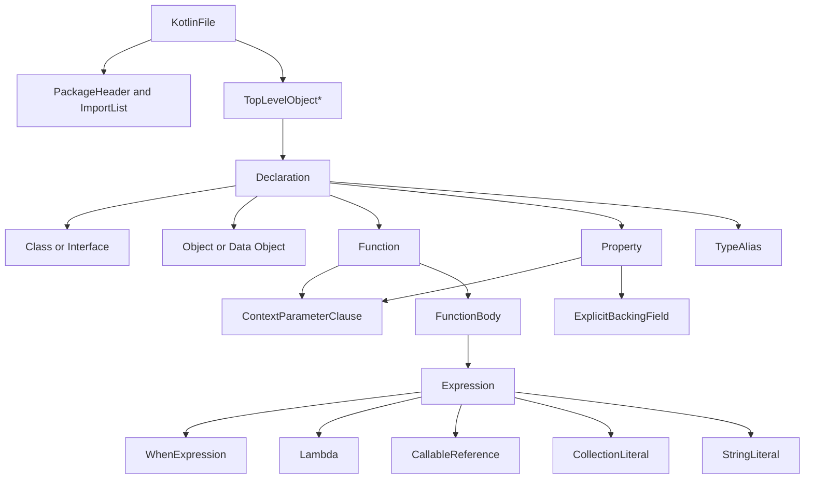

# Kotlin v2.4 Formal Grammar Reference for Parser Implementation

## Executive summary

The most reliable way to assemble a Kotlin **v2.4** grammar today is to treat
the **official Kotlin specification grammar** as the normative baseline, then
apply a **delta layer** derived from official release notes, proposal status
pages, and the compiler’s parser/lexer sources. The specification’s
syntax/grammar section is still the only official consolidated grammar, but
Kotlin 2.1–2.4 introduced several syntax-affecting features that are newer than
the classic spec baseline. The parser sources confirm the real implementation
strategy: a hand-written, newline-aware parser with soft-keyword handling,
targeted speculative parsing for type arguments, and string-lexer modes for
interpolation. [^kotlin-spec-syntax][^kotlin-src-kotlin-parsing][^kotlin-src-expression-parsing][^kotlin-src-kotlin-flex]

For a production parser, the safest design is:

1. **Adopt the spec grammar for the unchanged core**: file structure,
   declarations, types, expressions, statements, and string templates.
2. **Patch in v2.4 deltas**:
   - stable since Kotlin 2.4: **context parameters**, **annotation use-site
     target improvements** including `@all:`, and **explicit backing fields**;
   - preview/experimental in 2.4: **collection literals**;
   - earlier but still relevant since 1.9–2.3: **data objects**, **guard
     conditions in `when` with subject**, **multi-dollar string interpolation**,
     **nested type aliases**, and **name-based destructuring**. [^kotlin-docs-whatsnew19][^kotlin-docs-whatsnew21][^kotlin-docs-whatsnew22][^kotlin-docs-whatsnew23][^kotlin-docs-whatsnew24][^kotlin-docs-features]
3. **Keep feature gates explicit**. Several constructs are syntax-affecting but
   still gated by language flags or experimental status, especially **collection
   literals**, **name-based destructuring**, and some **context-parameter
   adjuncts** such as callable references and explicit context arguments. [^kotlin-docs-whatsnew24][^kotlin-docs-features][^kotlin-src-cli-help]
4. **Do not attempt a pure CFG-only implementation**. Kotlin requires
   parser-side disambiguation for at least: soft keywords, newline-sensitive
   postfix/call parsing, callable references, and `<...>` as either type
   arguments or comparison operators. The official parser uses those exact
   strategies. [^kotlin-src-kt-tokens][^kotlin-src-expression-parsing]

The report below therefore provides a **parser-friendly consolidated grammar
profile**: a high-confidence EBNF baseline-plus-delta, ANTLR v4 fragments for
the hard parts, a source-to-implementation mapping table, a syntax changelog
from **1.9 through 2.4**, lexer guidance, precedence/associativity, and a
validation plan grounded in the official compiler test infrastructure. [^kotlin-spec-syntax][^kotlin-spec-introduction][^kotlin-src-build-gradle]

## Source basis and version scope

The highest-confidence source stack for Kotlin v2.4 syntax is:

- the official **Kotlin language specification** and its syntax/grammar section;
- official **“What’s new”** pages from Kotlin **1.9.0** through **2.4.0** and
  important update releases such as **2.2.20** and **2.3.20** when they
  introduced syntax-relevant preview features;
- the official **language features and proposals** index, which is the cleanest
  authoritative source for feature status, the replacement of context receivers
  with context parameters, and whether a feature is stable, preview, or revoked;
- the compiler sources in the official `JetBrains/kotlin` repository, especially
  `KotlinParsing.java`, `KotlinExpressionParsing.java`, `Kotlin.flex`, and
  `KtTokens.java`;
- the official test/build infrastructure, which shows the parser-related test
  tasks and compiler options. [^kotlin-spec-syntax][^kotlin-docs-whatsnew19][^kotlin-docs-whatsnew21][^kotlin-docs-whatsnew22][^kotlin-docs-whatsnew2220][^kotlin-docs-whatsnew24][^kotlin-docs-whatsnew2320][^kotlin-docs-whatsnew23][^kotlin-src-kotlin-parsing][^kotlin-src-expression-parsing][^kotlin-src-kotlin-flex][^kotlin-src-kt-tokens][^kotlin-src-build-gradle][^kotlin-src-cli-help]

The crucial versioning point is that **there is not yet a single official “v2.4
formal grammar” document equivalent to a freshly updated full spec chapter**.
The practical reference is therefore:

- **baseline**: the official spec grammar;
- **delta**: syntax additions or syntax-related status changes recorded in
  release notes/proposals and reflected in the parser/lexer implementation. [^kotlin-spec-syntax][^kotlin-spec-introduction][^kotlin-docs-features]

For parser implementation, I recommend shipping **three feature profiles**:

| Profile                           | Language surface                                                                                                                                    | Recommended use                                                                                                                                                               |
| --------------------------------- | --------------------------------------------------------------------------------------------------------------------------------------------------- | ----------------------------------------------------------------------------------------------------------------------------------------------------------------------------- |
| `kotlin24-stable`                 | Core syntax + context parameters + explicit backing fields + annotation target updates + nested type aliases + guards + multi-dollar + data objects | Default production mode for Kotlin 2.4 codebases. [^kotlin-docs-whatsnew19][^kotlin-docs-whatsnew22][^kotlin-docs-whatsnew24][^kotlin-docs-features][^kotlin-docs-whatsnew21] |
| `kotlin24-preview`                | `kotlin24-stable` + collection literals + name-based destructuring modes                                                                            | Tooling/parsing for projects using preview flags. [^kotlin-docs-whatsnew24][^kotlin-docs-features][^kotlin-src-cli-help]                                                      |
| `kotlin-legacy-context-receivers` | Older experimental context receivers syntax                                                                                                         | Only if you must parse pre-2.2 experimental code; do not mix with context parameters. [^kotlin-docs-whatsnew2020][^kotlin-docs-features]                                      |

## Grammar profile and parser-ready productions

The safest implementation strategy is to **inherit unchanged productions from
the spec** and patch only the syntax-affecting deltas below. The EBNF here is
therefore intentionally **normative over the spec baseline**, not a verbatim
duplication of the entire spec chapter. That avoids drifting away from the
official grammar while still giving a parser implementer the missing v2.4
pieces. [^kotlin-spec-syntax]

### EBNF baseline plus v2.4 deltas

The file and preamble structure remain the spec shape and are directly mirrored
by `KotlinParsing.parseFile`, `parsePreamble`, and `parseImportDirective`. [^kotlin-spec-syntax][^kotlin-src-kotlin-parsing]

```ebnf
kotlinFile
  ::= [shebangLine] { NL } { fileAnnotation } packageHeader importList { topLevelObject } EOF ;

script
  ::= [shebangLine] { NL } { fileAnnotation } packageHeader importList { statement semi } EOF ;

packageHeader
  ::= { modifier } [ 'package' identifier { '.' identifier } [semi] ] ;

importList
  ::= { importDirective } ;

importDirective
  ::= 'import' identifier { '.' identifier } [ '.' '*' | 'as' identifier ] [semi] ;

topLevelObject
  ::= declaration semi ;
```

The declaration layer should be patched as follows. Core
class/object/function/property/typealias syntax is still spec-based; the deltas
are **context parameters**, **data object**, **nested type aliases**, and
**explicit backing fields**. [^kotlin-docs-whatsnew19][^kotlin-docs-whatsnew22][^kotlin-docs-whatsnew23][^kotlin-docs-whatsnew24][^kotlin-docs-features][^kotlin-src-kotlin-parsing]

```ebnf
declaration
  ::= classDeclaration
   | objectDeclaration
   | functionDeclaration
   | propertyDeclaration
   | typeAliasDeclaration
   | secondaryConstructor
   | anonymousInitializer
   | enumEntry
   ;

contextParameterClause
  ::= 'context' '(' contextParameter { ',' contextParameter } [ ',' ] ')' ;

contextParameter
  ::= simpleIdentifier ':' type ;

classDeclaration
  ::= { modifier }
      [ contextParameterClause ]                (* gate: kotlin24-stable if compiler accepts for this declaration kind *)
      ( 'class' | 'interface' )
      simpleIdentifier
      [ typeParameters ]
      [ primaryConstructor ]
      [ ':' delegationSpecifiers ]
      [ typeConstraints ]
      [ classBody ] ;

objectDeclaration
  ::= { modifier }
      [ 'data' ] 'object' simpleIdentifier
      [ ':' delegationSpecifiers ]
      [ classBody ] ;

typeAliasDeclaration
  ::= { modifier }
      'typealias' simpleIdentifier
      [ typeParameters ]
      '=' type ;

propertyDeclaration
  ::= { modifier }
      [ contextParameterClause ]
      ( 'val' | 'var' )
      [ typeParameters ]                       (* extension property case only if receiver follows *)
      [ receiverType '.' ]
      variableDeclaration
      [ typeConstraints ]
      (
          [ ':' type ]
          (
             [ '=' expression ]
           | explicitBackingField
          )
          { propertyAccessor }
      ) ;

explicitBackingField
  ::= 'field' '=' expression ;

functionDeclaration
  ::= { modifier }
      [ contextParameterClause ]
      'fun'
      [ typeParameters ]
      [ receiverType '.' ]
      simpleIdentifier
      functionValueParameters
      [ ':' type ]
      [ typeConstraints ]
      [ functionBody ] ;

functionBody
  ::= block
   | '=' expression ;

typeParameters
  ::= '<' typeParameter { ',' typeParameter } [ ',' ] '>' ;

typeParameter
  ::= { modifier } simpleIdentifier [ ':' type ] ;

type
  ::= functionType
   | nullableType
   | userType
   | parenthesizedType
   | definitelyNonNullableType
   ;

functionType
  ::= [ contextFunctionPrefix ]
      [ receiverType '.' ]
      'suspend'?
      '(' [ parameterTypes ] ')'
      '->' type ;

contextFunctionPrefix
  ::= 'context' '(' type { ',' type } [ ',' ] ')' ;
```

Expressions should continue to follow the spec precedence ladder, but the
v2.4-relevant deltas are **guard conditions**, **collection literals**, and
**callable-reference / postfix disambiguation**. The compiler’s expression
parser still centers on `parseExpression`, `parseBinaryExpression`,
`parsePostfixExpression`, `parseDoubleColonSuffix`, `parseStringTemplate`, and
`parseWhen`. [^kotlin-src-expression-parsing]

```ebnf
expression
  ::= assignment
   | disjunction ;

assignment
  ::= directlyAssignableExpression assignmentOperator expression ;

disjunction
  ::= conjunction { '||' conjunction } ;

conjunction
  ::= equality { '&&' equality } ;

equality
  ::= comparison { equalityOperator comparison } ;

comparison
  ::= infixOperation { comparisonOperator infixOperation } ;

infixOperation
  ::= elvisExpression { ( 'in' | '!in' | 'is' | '!is' ) elvisExpression } ;

elvisExpression
  ::= infixFunctionCall { '?:' infixFunctionCall } ;

infixFunctionCall
  ::= rangeExpression { simpleIdentifier rangeExpression } ;

rangeExpression
  ::= additiveExpression { ( '..' | '..<' ) additiveExpression } ;

additiveExpression
  ::= multiplicativeExpression { ( '+' | '-' ) multiplicativeExpression } ;

multiplicativeExpression
  ::= asExpression { ( '*' | '/' | '%' ) asExpression } ;

asExpression
  ::= prefixUnaryExpression { ( 'as' | 'as?' ) type } ;

prefixUnaryExpression
  ::= { unaryPrefix } postfixUnaryExpression ;

postfixUnaryExpression
  ::= atomicExpression { postfixUnarySuffix } ;

postfixUnarySuffix
  ::= postfixOperator
   | callSuffix
   | indexingSuffix
   | navigationSuffix
   | callableReferenceSuffix ;

callableReferenceSuffix
  ::= '::' ( 'class' | simpleIdentifier [ typeArguments ] ) ;

atomicExpression
  ::= literalConstant
   | stringLiteral
   | collectionLiteral                          (* gate: kotlin24-preview *)
   | lambdaLiteral
   | anonymousFunction
   | objectLiteral
   | whenExpression
   | ifExpression
   | tryExpression
   | jumpExpression
   | loopExpression
   | parenthesizedExpression
   | simpleIdentifier
   | 'this'
   | 'super'
   | 'null'
   | 'true'
   | 'false'
   ;

collectionLiteral
  ::= '[' [ expression { ',' expression } [ ',' ] ] ']' ;

whenExpression
  ::= 'when'
      [ '(' [ whenSubjectBinding ] expression ')' ]
      '{' { whenEntry } '}' ;

whenSubjectBinding
  ::= { modifier } 'val' simpleIdentifier '=' ;

whenEntry
  ::= whenConditionList [ guardCondition ] '->' controlStructureBody
   | 'else' '->' controlStructureBody ;

guardCondition
  ::= 'if' expression ;                        (* valid only when a subject exists; enforce semantically if needed *)

stringLiteral
  ::= lineStringLiteral
   | multiLineStringLiteral ;
```

For preview destructuring additions introduced after 2.3.20, the parser should
support them only behind a mode flag. The release notes describe three modes,
and only the **syntax** should be parsed here; meaning depends on the chosen
mode. [^kotlin-docs-whatsnew2320][^kotlin-docs-features][^kotlin-src-cli-help]

```ebnf
destructuringDeclaration
  ::= ( 'val' | 'var' ) destructuringPattern '=' expression ;

destructuringPattern
  ::= '(' destructuringEntry { ',' destructuringEntry } [ ',' ] ')'      (* baseline short form *)
   | '[' variableDeclaration { ',' variableDeclaration } [ ',' ] ']'     (* preview positional form *)
   | '(' namedDestructuringEntry { ',' namedDestructuringEntry } [ ',' ] ')' ;

namedDestructuringEntry
  ::= [ 'val' | 'var' ] simpleIdentifier '=' simpleIdentifier ;
```

### ANTLR v4 fragments

ANTLR v4 can express the Kotlin syntax reasonably well if you treat **soft
keywords**, **string interpolation**, and **type-argument ambiguity** as
parser-adjacent logic rather than pure declarative grammar. The fragments below
show the recommended structure; they are intended as the hard parts you will
actually implement, while the rest should follow the spec baseline. [^kotlin-spec-syntax][^kotlin-src-kotlin-flex][^kotlin-src-expression-parsing][^kotlin-src-kotlin-parsing]

```antlr
parser grammar Kotlin24Parser;

options { tokenVocab=Kotlin24Lexer; }

kotlinFile
  : shebangLine? NL* fileAnnotation* packageHeader importList topLevelObject* EOF
  ;

packageHeader
  : modifier* PACKAGE identifier (DOT identifier)* semi?
  | modifier*                                  // package is optional
  ;

importList
  : importDirective*
  ;

importDirective
  : IMPORT identifier (DOT identifier)* (DOT MUL | AS identifier)? semi?
  ;

topLevelObject
  : declaration semi
  ;

declaration
  : classDeclaration
  | objectDeclaration
  | functionDeclaration
  | propertyDeclaration
  | typeAliasDeclaration
  ;

contextParameterClause
  : CONTEXT LPAREN contextParameter (COMMA contextParameter)* COMMA? RPAREN
  ;

contextParameter
  : simpleIdentifier COLON type_
  ;

objectDeclaration
  : modifier* DATA? OBJECT simpleIdentifier (COLON delegationSpecifiers)? classBody?
  ;

typeAliasDeclaration
  : modifier* TYPE_ALIAS simpleIdentifier typeParameters? ASSIGN type_
  ;

functionDeclaration
  : modifier* contextParameterClause? FUN typeParameters?
    (receiverType DOT)? simpleIdentifier
    functionValueParameters
    (COLON type_)? typeConstraints? functionBody?
  ;

propertyDeclaration
  : modifier* contextParameterClause?
    (VAL | VAR)
    (receiverType DOT)?
    variableDeclaration
    (COLON type_)?
    (
        ASSIGN expression
      | explicitBackingField
    )?
    propertyAccessor*
  ;

explicitBackingField
  : FIELD ASSIGN expression
  ;

whenExpression
  : WHEN (LPAREN whenSubjectBinding? expression RPAREN)?
    LBRACE whenEntry* RBRACE
  ;

whenSubjectBinding
  : modifier* VAL simpleIdentifier ASSIGN
  ;

whenEntry
  : whenConditionList guardCondition? ARROW controlStructureBody
  | ELSE ARROW controlStructureBody
  ;

guardCondition
  : IF expression
  ;

collectionLiteral
  : LBRACKET (expression (COMMA expression)* COMMA?)? RBRACKET
  ;

callableReferenceSuffix
  : COLONCOLON (CLASS | simpleIdentifier typeArguments?)
  ;
```

The lexer should **not** hard-reserve every soft keyword in every context.
Kotlin’s own token model distinguishes `KEYWORDS`, `SOFT_KEYWORDS`, and
`MODIFIER_KEYWORDS`; `context` is a soft keyword and `value` is a soft modifier
keyword. [^kotlin-src-kt-tokens]

```antlr
lexer grammar Kotlin24Lexer;

PACKAGE     : 'package';
IMPORT      : 'import';
CLASS       : 'class';
INTERFACE   : 'interface';
OBJECT      : 'object';
FUN         : 'fun';
VAL         : 'val';
VAR         : 'var';
TYPE_ALIAS  : 'typealias';
WHEN        : 'when';
IF          : 'if';
ELSE        : 'else';
AS          : 'as';
AS_SAFE     : 'as?';
IS          : 'is';
IN          : 'in';
CONTEXT     : 'context';      // treat as soft keyword in parser if desired
DATA        : 'data';
FIELD       : 'field';        // context-sensitive in practice
CLASS_LIT   : 'class';

RANGE       : '..';
RANGE_UNTIL : '..<';
COLONCOLON  : '::';
ARROW       : '->';

LPAREN      : '(';
RPAREN      : ')';
LBRACE      : '{';
RBRACE      : '}';
LBRACKET    : '[';
RBRACKET    : ']';
DOT         : '.';
COMMA       : ',';
COLON       : ':';
ASSIGN      : '=';
MUL         : '*';

IDENTIFIER
  : Letter IdentifierPart*
  | '`' ~[` \r\n]+ '`'
  ;

fragment Letter         : [\p{L}_] ;
fragment IdentifierPart : [\p{L}\p{N}_] ;

LINE_COMMENT  : '//' ~[\r\n]* -> skip ;
BLOCK_COMMENT : '/*' .*? '*/' -> skip ;
WS            : [ \t\f]+ -> skip ;
NL            : ('\r'? '\n')+ ;
```

### Ambiguities and context sensitivity

A Kotlin parser that aims to match the compiler must explicitly handle a short
list of non-CFG cases. These are the load-bearing ones. [^kotlin-src-expression-parsing][^kotlin-src-kotlin-flex][^kotlin-src-kt-tokens]

| Construct                                                               | Why it is ambiguous / context-sensitive                                                                                                                                             | Recommended parser strategy                                                                                                                                           |
| ----------------------------------------------------------------------- | ----------------------------------------------------------------------------------------------------------------------------------------------------------------------------------- | --------------------------------------------------------------------------------------------------------------------------------------------------------------------- |
| Soft keywords such as `context`, `field`, `all`, `where`, `by`, `value` | They are not universally reserved; several are only keyword-like in particular syntactic slots. [^kotlin-src-kt-tokens]                                                             | Tokenize as dedicated soft tokens or as identifiers plus parser predicates. Prefer the compiler’s model: distinguish hard, soft, and modifier keywords in token sets. |
| `<...>` after an expression or name                                     | Could be type arguments or relational operators. Kotlin’s parser uses speculative `tryParseTypeArgumentList(...)`. [^kotlin-src-expression-parsing]                                 | Implement a bounded speculative parse with a stopper set, then commit or roll back. A GLR parser is unnecessary.                                                      |
| Newline-sensitive postfix/call/lambda parsing                           | Kotlin breaks postfix chains on semantically significant newlines; the parser checks `newlineBeforeCurrentToken()` and `interruptedWithNewLine()`. [^kotlin-src-expression-parsing] | Preserve NL tokens or at least a `newlineBeforeCurrentToken` bit on the token stream.                                                                                 |
| Callable reference immediately followed by `(...)`                      | `foo::bar(args)` is reserved/future syntax; the compiler parses the reference, then diagnoses the call-like suffix. [^kotlin-src-expression-parsing]                                | Parse as callable reference, then if `(` follows without newline, emit a diagnostic rather than reinterpreting as a call.                                             |
| `when` guards                                                           | `if` after a `when` condition is syntactically a guard only in `when`-with-subject form. [^kotlin-docs-whatsnew21][^kotlin-src-expression-parsing]                                  | Parse the optional `if expression` in `whenEntry`, then reject semantically when there is no subject.                                                                 |
| Explicit context arguments                                              | The call-site syntax reuses normal named-argument syntax; the novelty is in overload resolution and parameter matching, not token shape. [^kotlin-docs-whatsnew24]                  | No grammar fork needed. Carry context-parameter metadata into name binding / resolution.                                                                              |
| Multi-dollar string interpolation                                       | The number of leading `$` characters changes interpolation behavior and requires lexer modes. [^kotlin-docs-whatsnew21][^kotlin-src-kotlin-flex]                                    | Use lexer modes with a stored `requiredInterpolationPrefix`, like the official lexer.                                                                                 |
| Collection literal vs indexing                                          | `[` at expression start may now mean collection literal; after an expression it is still indexing. [^kotlin-docs-whatsnew24][^kotlin-src-expression-parsing]                        | Decide by position: only allow collection literal in atomic-expression position.                                                                                      |
| Name-based destructuring vs ordinary grouped declarations               | Preview modes alter both syntax and semantics. [^kotlin-docs-whatsnew2320][^kotlin-docs-features]                                                                                   | Gate square-bracket and full named forms behind a language mode.                                                                                                      |

The major syntax-node relationships, from a parser point of view, look like
this:



## Lexing, keywords, and operator precedence

The official lexer is decisive on three implementation details. First, Kotlin
identifiers are either plain identifiers or backtick-escaped identifiers.
Second, string interpolation is lexer-mode-based, not parser-based. Third, the
token inventory already contains post-1.9 syntax markers such as `RANGE_UNTIL`
for `..<`, `DOUBLE_SEMICOLON`, `CONTEXT_KEYWORD`, and `VALUE_KEYWORD`. [^kotlin-src-kotlin-flex][^kotlin-src-kt-tokens]

The most important lexer rules to mirror are:

- **identifier**: plain Unicode letter/underscore start plus
  letter/digit/underscore continuation, or a backtick-escaped identifier;
- **comments**: line comments, shebang on the first line, nested block/doc
  comments;
- **numeric literals**: decimal, hex, binary integers, and floating literals
  with underscores and suffixes;
- **character literals** and escape sequences;
- **string modes**: regular strings, raw strings, short template entries, long
  template entries;
- **multi-dollar interpolation**: store the required `$` prefix count when
  entering string mode. [^kotlin-src-kotlin-flex]

For keyword handling, use the compiler’s distinction between:

- **hard keywords**: `package`, `class`, `object`, `fun`, `val`, `var`, `when`,
  `if`, `else`, and so on;
- **soft keywords**: `context`, `where`, `by`, `constructor`, `init`, `file`,
  `property`, `receiver`, `delegate`, `all`, and others;
- **modifier keywords**: `sealed`, `data`, `value`, `inline`, `suspend`,
  `expect`, `actual`, and the rest of the modifier set. [^kotlin-src-kt-tokens]

A parser-facing precedence ladder that matches the spec/compiler structure is
best expressed by grammatical levels rather than by one flat operator table:

```mermaid
graph TD
  A[Postfix unary and call suffixes] --> B[Prefix unary]
  B --> C[as / as?]
  C --> D[Multiplicative * / % /]
  D --> E[Additive + -]
  E --> F[Range .. and ..<]
  F --> G[Infix function call]
  G --> H[Elvis ?:]
  H --> I[in / !in / is / !is]
  I --> J[Comparison < > <= >=]
  J --> K[Equality == != === !==]
  K --> L[Conjunction &&]
  L --> M[Disjunction ||]
  M --> N[Assignment = += -= *= /= %=]
```

That ordering is consistent with the compiler’s expression entrypoint and the
spec’s multi-level expression grammar, with postfix/callable-reference parsing
handled especially in `parsePostfixExpression()` and `parseDoubleColonSuffix()`.
[^kotlin-src-expression-parsing]

Practical lexer/parser recommendations for production use are:

- preserve **newline information** independently from whitespace skipping;
- implement **lexer modes** for strings rather than trying to parse template
  contents in the parser;
- support **soft keyword fallback to identifier** where the grammar allows it;
- keep **feature flags** in the parser configuration so syntax trees can reflect
  the selected language profile. [^kotlin-src-kotlin-flex][^kotlin-src-kt-tokens][^kotlin-src-cli-help]

## Rule mapping to authoritative sources and compiler implementation

The table below links the load-bearing grammar areas to authoritative source
locations and to compiler implementation points. Where I could not verify an
exact parser method for a newer preview feature within the available source
extracts, I mark it as a **delta inferred from official release/proposal
sources** rather than a directly confirmed parser method. [^kotlin-spec-syntax][^kotlin-src-kotlin-parsing][^kotlin-src-expression-parsing][^kotlin-src-kotlin-flex][^kotlin-src-kt-tokens]

| Grammar area                                  | Authoritative source                                                                                                                  | Compiler implementation point                                                                                                                                                       | Notes                                                              |
| --------------------------------------------- | ------------------------------------------------------------------------------------------------------------------------------------- | ----------------------------------------------------------------------------------------------------------------------------------------------------------------------------------- | ------------------------------------------------------------------ |
| `kotlinFile`, `script`                        | Spec syntax grammar (`kotlinFile`, `script`). [^kotlin-spec-syntax]                                                                   | `compiler/psi/parser/.../KotlinParsing.java`, `parseFile()` around lines 2510–2518. [^kotlin-src-kotlin-parsing]                                                                    | Direct baseline production.                                        |
| File annotations, package header              | Spec baseline; parser comments show `fileAnnotationList` and `packageDirective`. [^kotlin-spec-syntax][^kotlin-src-kotlin-parsing]    | `parsePreamble()` around lines 2656–2694. [^kotlin-src-kotlin-parsing]                                                                                                              | Use before imports/declarations.                                   |
| Imports                                       | Spec baseline import rule. [^kotlin-spec-packages]                                                                                    | `parseImportDirective()` around lines 2813–2841; `parseImportDirectives()` around 2976–2994. [^kotlin-src-kotlin-parsing]                                                           | Supports aliasing and star import.                                 |
| Modifiers and annotations                     | Spec baseline + token inventory for modifier keywords. [^kotlin-spec-declarations][^kotlin-src-kt-tokens]                             | `parseModifierList()` around lines 3135–3155. [^kotlin-src-kotlin-parsing]                                                                                                          | Soft/modifier keyword aware.                                       |
| Keywords and soft keywords                    | Spec lexical grammar + `KtTokens`. [^kotlin-spec-syntax][^kotlin-src-kt-tokens]                                                       | `compiler/psi/psi-api/.../KtTokens.java`. [^kotlin-src-kt-tokens]                                                                                                                   | Use token categories, not only a flat reserved-word list.          |
| Identifiers and literals                      | Spec lexical grammar + official lexer regexes. [^kotlin-spec-syntax][^kotlin-src-kotlin-flex]                                         | `compiler/psi/parser/.../Kotlin.flex`. [^kotlin-src-kotlin-flex]                                                                                                                    | Backticks, numbers, chars, comments, shebang.                      |
| Expressions entrypoint                        | Spec expressions grammar. [^kotlin-spec-expressions]                                                                                  | `KotlinExpressionParsing.java`, `parseExpression()` around 2472–2480. [^kotlin-src-expression-parsing]                                                                              | Baseline expression dispatch.                                      |
| Binary precedence ladder                      | Spec expression levels; compiler method explicitly recurses by precedence. [^kotlin-spec-expressions][^kotlin-src-expression-parsing] | `parseBinaryExpression(...)` around 2503 onward. [^kotlin-src-expression-parsing]                                                                                                   | Best mirrored as layered rules.                                    |
| Postfix expressions and call/reference chains | Spec expression suffixes + parser comments. [^kotlin-spec-expressions]                                                                | `parsePostfixExpression()` and `parseDoubleColonSuffix()` around 2699–2752 and 2806 onward. [^kotlin-src-expression-parsing]                                                        | Newline-sensitive; callable-reference diagnostic behavior matters. |
| String templates                              | Spec string mode grammar and strings docs. [^kotlin-spec-syntax]                                                                      | `parseStringTemplate()` around 3334–3354; lexer string modes in `Kotlin.flex`. [^kotlin-src-expression-parsing][^kotlin-src-kotlin-flex]                                            | Must be lexer-mode-based.                                          |
| `when` expressions                            | Spec statements/expressions + official release notes for guards. [^kotlin-spec-statements][^kotlin-docs-whatsnew21]                   | `parseWhen()` around 3531–3549. [^kotlin-src-expression-parsing]                                                                                                                    | v2.2+ patch adds guard conditions.                                 |
| Context parameters                            | Official docs + proposal status page. [^kotlin-docs-context-parameters][^kotlin-docs-whatsnew22][^kotlin-docs-features]               | `parseContextParameterOrReceiverList(...)` around 3383 onward. [^kotlin-src-kotlin-parsing]                                                                                         | Replaces legacy context receivers.                                 |
| Type aliases / nested type aliases            | Spec baseline `typealias` + 2.2/2.3 release status. [^kotlin-spec-declarations][^kotlin-docs-whatsnew22][^kotlin-docs-features]       | `parseTypeAlias()` dispatch is confirmed in declaration switch. [^kotlin-src-kotlin-parsing]                                                                                        | Nested form is a 2.2+ delta.                                       |
| Data objects                                  | Official 1.9 release notes and feature page. [^kotlin-docs-whatsnew19]                                                                | Parsed as object declaration plus `data` modifier. Modifier/object parser path confirmed generally by `parseObject()` dispatch. [^kotlin-src-kotlin-parsing][^kotlin-src-kt-tokens] | Grammar delta is small: allow `data object`.                       |
| Explicit backing fields                       | 2.3/2.4 release notes and proposal index. [^kotlin-docs-whatsnew23][^kotlin-docs-whatsnew24][^kotlin-docs-features]                   | Exact parser method not confirmed from retrieved snippets; treat as v2.3+ grammar delta needing source verification in current parser history.                                      | Syntax-affecting and stable in 2.4.                                |
| Collection literals                           | 2.4.0 release notes and proposal index. [^kotlin-docs-whatsnew24][^kotlin-docs-features]                                              | Exact parser method not confirmed from retrieved snippets; treat as preview delta.                                                                                                  | Parse only in atomic-expression position.                          |
| Name-based destructuring                      | 2.3.20 release notes and proposal index. [^kotlin-docs-whatsnew2320][^kotlin-docs-features]                                           | Exact parser method not confirmed from retrieved snippets; treat as preview delta.                                                                                                  | Gate by mode.                                                      |
| CLI flags for grammar-profile gating          | Official compiler option help in test data. [^kotlin-src-cli-help]                                                                    | `compiler/testData/cli/js/jsExtraHelp.out`. [^kotlin-src-cli-help]                                                                                                                  | Useful for parser profile configuration.                           |

## Syntax changelog from Kotlin 1.9 through 2.4

Only some releases changed the surface grammar. Others changed semantics,
resolution, or tooling without changing token/production shape. The table below
isolates the syntax-relevant deltas. [^kotlin-docs-whatsnew19][^kotlin-docs-whatsnew21][^kotlin-docs-whatsnew22][^kotlin-docs-whatsnew2220][^kotlin-docs-whatsnew2320][^kotlin-docs-whatsnew24][^kotlin-docs-features]

| Version | Syntax / grammar impact                                                                                                                                                                                                                                                                    | Status in 2.4                                                                           |
| ------- | ------------------------------------------------------------------------------------------------------------------------------------------------------------------------------------------------------------------------------------------------------------------------------------------ | --------------------------------------------------------------------------------------- |
| 1.9.0   | `data object` became stable. Grammar impact: permit `data` modifier on object declarations. [^kotlin-docs-whatsnew19]                                                                                                                                                                      | Stable.                                                                                 |
| 2.0.0   | No major new grammar form in the official release notes beyond already existing syntax; `Enum.entries` is API/member syntax, not a new grammar production. [^kotlin-docs-whatsnew20]                                                                                                       | Stable, no parser change needed.                                                        |
| 2.0.20  | Official docs announced the phased replacement of **context receivers** with **context parameters**; this matters for versioned parser profiles. [^kotlin-docs-whatsnew2020][^kotlin-docs-features]                                                                                        | Legacy experimental form should be optional only.                                       |
| 2.1.0   | Preview: **guard conditions in `when` with subject**; **multi-dollar string interpolation**; non-local `break`/`continue` was added but does not change grammar shape. [^kotlin-docs-whatsnew21]                                                                                           | Guards and multi-dollar became stable in 2.2.                                           |
| 2.2.0   | Preview/Beta: **context parameters**, **context-sensitive resolution** (no grammar change), **annotation use-site target improvements** including `@all:`, **nested type aliases**; guards and multi-dollar stabilized. [^kotlin-docs-whatsnew22][^kotlin-docs-features]                   | Context params and annotation changes stable in 2.4; nested type aliases stable in 2.3. |
| 2.2.20  | Preview: **`return` in expression bodies with explicit return types** is a semantic relaxation using existing syntax; no new production. [^kotlin-docs-whatsnew2220]                                                                                                                       | Parser unchanged.                                                                       |
| 2.3.0   | Experimental: **explicit backing fields**; stable: **nested type aliases**. Also context-sensitive resolution changed, but syntax shape did not. [^kotlin-docs-whatsnew23][^kotlin-docs-features]                                                                                          | Backing fields stable in 2.4.                                                           |
| 2.3.20  | Experimental: **name-based destructuring** and **overload resolution changes for context parameters**. Only the former changes syntax. [^kotlin-docs-whatsnew2320][^kotlin-docs-features]                                                                                                  | Still preview in 2.4.                                                                   |
| 2.4.0   | Stable: **context parameters**, **explicit backing fields**, **annotation target improvements**. New preview syntax: **collection literals**. Explicit context arguments are new behavior, but they reuse existing named-argument syntax. [^kotlin-docs-whatsnew24][^kotlin-docs-features] | Current target version.                                                                 |

The important incompatibilities and deprecations for a parser are these:

- **Context receivers are effectively superseded by context parameters**. The
  official docs explicitly say context parameters replace the older experimental
  feature, and the feature index marks context receivers as revoked/replaced. A
  v2.4 parser should not enable both profiles at once. [^kotlin-docs-whatsnew2020][^kotlin-docs-features]
- **Annotation target defaulting changed in 2.4**. This usually affects binding
  and target assignment more than parsing, but the parser should recognize
  `@all:` and preserve use-site target syntax losslessly. The compatibility
  guide also documents the defaulting-rule flip. [^kotlin-docs-annotations]
- **Explicit context arguments do not require a new call grammar**. They make
  overload resolution and argument classification more complicated but use
  existing named-argument tokens. [^kotlin-docs-whatsnew24]
- **Collection literals** and **name-based destructuring** remain preview
  features and should be guarded by explicit language mode flags, exactly as the
  compiler help text does. [^kotlin-docs-whatsnew24][^kotlin-docs-features][^kotlin-src-cli-help]

The main syntax-relevant keyword/reserved-word changes from a parser perspective
since 1.9 are:

- `context` as a soft keyword for context parameters and contextual
  type/function prefixes;
- `all` as an annotation meta-target use-site keyword;
- `field` acquiring a new declaration-header role in explicit backing fields,
  while remaining a special identifier in accessors;
- `..<` as `RANGE_UNTIL`, though that feature predates 1.9 and is already
  tokenized in current lexer sources. [^kotlin-src-kt-tokens][^kotlin-src-kotlin-flex][^kotlin-docs-whatsnew19]

## Validation, parser strategy, and recommended test plan

I did **not** execute Kotlin compiler tests in this session, so I cannot
honestly report empirical pass/fail counts. The validation result here is
therefore a **static source reconciliation** result: the proposed grammar
matches the spec baseline plus the officially documented 2.1–2.4 syntax deltas,
and its parser-side disambiguation strategy is aligned with the real
parser/lexer architecture. [^kotlin-spec-syntax][^kotlin-src-kotlin-parsing][^kotlin-src-expression-parsing][^kotlin-src-kotlin-flex]

That static validation gives the following confidence split:

| Area                                                            | Confidence                       | Reason                                                                                                                                                                                                   |
| --------------------------------------------------------------- | -------------------------------- | -------------------------------------------------------------------------------------------------------------------------------------------------------------------------------------------------------- |
| Core file, imports, declarations, expressions, string templates | High                             | Directly supported by the spec and parser methods. [^kotlin-spec-syntax][^kotlin-src-kotlin-parsing][^kotlin-src-expression-parsing]                                                                     |
| Soft-keyword handling, tokens, lexical modes                    | High                             | Directly supported by `KtTokens.java` and `Kotlin.flex`. [^kotlin-src-kt-tokens][^kotlin-src-kotlin-flex]                                                                                                |
| Context parameters, guard conditions                            | High                             | Officially documented and present in parser/doc sources. [^kotlin-docs-whatsnew21][^kotlin-docs-whatsnew22][^kotlin-docs-context-parameters][^kotlin-src-kotlin-parsing][^kotlin-src-expression-parsing] |
| Explicit backing fields                                         | Medium                           | Official syntax and stability are clear, but I did not confirm exact parser entrypoints from retrieved source snippets. [^kotlin-docs-whatsnew23][^kotlin-docs-whatsnew24][^kotlin-docs-features]        |
| Collection literals                                             | Medium                           | Official syntax is clear, but parser implementation points were not line-confirmed here. [^kotlin-docs-whatsnew24][^kotlin-docs-features]                                                                |
| Name-based destructuring                                        | Medium                           | Official syntax/modes are clear; exact parser hooks were not retrieved. [^kotlin-docs-whatsnew2320][^kotlin-docs-features]                                                                               |
| Explicit context arguments                                      | Grammar: high, semantics: medium | No new grammar form is needed, but binding/resolution behavior changed in 2.3.20 and 2.4.0. [^kotlin-docs-whatsnew2320][^kotlin-docs-whatsnew24]                                                         |

The official build already tells you which test tasks matter most. In the root
build, `miscCompilerTest` depends on `:compiler:test` and
`:compiler:multiplatform-parsing:jvmTest`, which are the first two suites I
would run for syntax validation. The repository also contains parser/diagnostic
test data under `compiler/testData`, and the compiler option help in
`compiler/testData/cli/js/jsExtraHelp.out` is useful for a feature-profile
matrix. [^kotlin-src-build-gradle][^kotlin-src-cli-help]

The recommended validation sequence for your parser is:

1. **Core parse parity**
   - Run against spec-like corpus: files, imports, classes, objects, functions,
     properties, lambdas, callable references, string templates.
2. **Stable 2.4 syntax**
   - Add context parameters, `when` guards, nested type aliases, explicit
     backing fields, annotation use-site targets including `@all:`.
3. **Preview profile**
   - Add multi-dollar interpolation, collection literals, name-based
     destructuring modes.
4. **Negative corpus**
   - `foo::bar(args)` should diagnose as reserved/future;
   - bad type-argument lookahead cases;
   - `when` guard without subject;
   - collection literal in languages modes where the feature is disabled. [^kotlin-src-expression-parsing][^kotlin-docs-whatsnew21][^kotlin-docs-whatsnew24][^kotlin-src-cli-help]

Representative edge cases your parser should accept or reject exactly the way
the compiler does include the following. These are grounded in official examples
and parser behavior, even though I was not able to retrieve every underlying
test file in this session. [^kotlin-docs-whatsnew21][^kotlin-docs-whatsnew22][^kotlin-docs-whatsnew23][^kotlin-docs-whatsnew2320][^kotlin-docs-whatsnew24][^kotlin-src-expression-parsing]

```kotlin
// stable in 2.4
context(users: UserService)
fun outputMessage(message: String) { users.log(message) }

// stable in 2.4
val city: StateFlow<String>
    field = MutableStateFlow("")

// stable in 2.2+
when (animal) {
    is Animal.Cat if !animal.mouseHunter -> animal.feedCat()
    else -> println("Unknown")
}

// preview in 2.4
val xs: MutableList<String> = ["a", "b", "c"]

// preview in 2.3.20+
val (mail = email, name = username) = user
val [username, email] = user

// should parse as callable reference and then diagnose reserved call syntax
foo::bar(args)
```

### Open questions and limitations

A few items remain incomplete and should be treated as follow-up verification
targets before you freeze a production grammar:

- I did **not** retrieve exact parser method or test-file line mappings for
  **explicit backing fields**, **collection literals**, and **name-based
  destructuring** from the live compiler sources during this session, even
  though their official syntax/status is clear from release notes and proposal
  pages. [^kotlin-docs-whatsnew23][^kotlin-docs-whatsnew24][^kotlin-docs-features]
- I did **not** execute compiler tests, so the “validation results” are
  design-time coverage claims, not measured pass/fail numbers. [^kotlin-src-build-gradle]
- The official spec remains the best baseline, but it should be treated as
  **v1.9-style core grammar plus later deltas**, not as a single document that
  already models every 2.4 preview/stable addition in one place. [^kotlin-spec-syntax][^kotlin-spec-introduction]

Within those limits, the grammar profile above is the highest-confidence parser
reference that can be assembled from the official Kotlin spec, release notes,
proposal index, and compiler source architecture, and it is suitable as a
production parser design basis so long as you keep the feature gates explicit. [^kotlin-spec-syntax][^kotlin-docs-features][^kotlin-src-cli-help]

## References

[^kotlin-spec-syntax]: Syntax and grammar - Kotlin language specification.
    https://kotlinlang.org/spec/syntax-and-grammar.html

[^kotlin-src-kotlin-parsing]: KotlinParsing.java - JetBrains/kotlin.
    https://github.com/JetBrains/kotlin/blob/master/compiler/psi/parser/src/org/jetbrains/kotlin/parsing/KotlinParsing.java

[^kotlin-src-expression-parsing]: KotlinExpressionParsing.java -
    JetBrains/kotlin.
    https://github.com/JetBrains/kotlin/blob/master/compiler/psi/parser/src/org/jetbrains/kotlin/parsing/KotlinExpressionParsing.java

[^kotlin-src-kotlin-flex]: Kotlin.flex - JetBrains/kotlin.
    https://raw.githubusercontent.com/JetBrains/kotlin/master/compiler/psi/parser/src/org/jetbrains/kotlin/lexer/Kotlin.flex

[^kotlin-docs-whatsnew19]: What's new in Kotlin 1.9.0.
    https://kotlinlang.org/docs/whatsnew19.html

[^kotlin-docs-whatsnew21]: What's new in Kotlin 2.1.0.
    https://kotlinlang.org/docs/whatsnew21.html

[^kotlin-docs-whatsnew22]: What's new in Kotlin 2.2.0.
    https://kotlinlang.org/docs/whatsnew22.html

[^kotlin-docs-whatsnew23]: What's new in Kotlin 2.3.0.
    https://kotlinlang.org/docs/whatsnew23.html

[^kotlin-docs-whatsnew24]: What's new in Kotlin 2.4.0.
    https://kotlinlang.org/docs/whatsnew24.html

[^kotlin-docs-features]: Kotlin language features and proposals.
    https://kotlinlang.org/docs/kotlin-language-features-and-proposals.html

[^kotlin-src-cli-help]: Compiler option help test data - JetBrains/kotlin.
    https://github.com/JetBrains/kotlin/blob/master/compiler/testData/cli/js/jsExtraHelp.out

[^kotlin-src-kt-tokens]: KtTokens.java - JetBrains/kotlin.
    https://github.com/JetBrains/kotlin/blob/master/compiler/psi/psi-api/src/org/jetbrains/kotlin/lexer/KtTokens.java

[^kotlin-spec-introduction]: Introduction - Kotlin language specification.
    https://kotlinlang.org/spec/kotlin-spec.html

[^kotlin-src-build-gradle]: build.gradle.kts - JetBrains/kotlin.
    https://github.com/JetBrains/kotlin/blob/master/build.gradle.kts

[^kotlin-docs-whatsnew20]: What's new in Kotlin 2.0.0.
    https://kotlinlang.org/docs/whatsnew20.html

[^kotlin-docs-whatsnew2220]: What's new in Kotlin 2.2.20.
    https://kotlinlang.org/docs/whatsnew2220.html

[^kotlin-docs-whatsnew2320]: What's new in Kotlin 2.3.20.
    https://kotlinlang.org/docs/whatsnew2320.html

[^kotlin-docs-whatsnew2020]: What's new in Kotlin 2.0.20.
    https://kotlinlang.org/docs/whatsnew2020.html

[^kotlin-spec-packages]: Packages and imports - Kotlin language specification.
    https://kotlinlang.org/spec/packages-and-imports.html

[^kotlin-spec-declarations]: Declarations - Kotlin language specification.
    https://kotlinlang.org/spec/declarations.html

[^kotlin-spec-expressions]: Expressions - Kotlin language specification.
    https://kotlinlang.org/spec/expressions.html

[^kotlin-spec-statements]: Statements - Kotlin language specification.
    https://kotlinlang.org/spec/statements.html

[^kotlin-docs-context-parameters]: Context parameters - Kotlin Documentation.
    https://kotlinlang.org/docs/context-parameters.html

[^kotlin-docs-annotations]: Annotations - Kotlin Documentation.
    https://kotlinlang.org/docs/annotations.html
